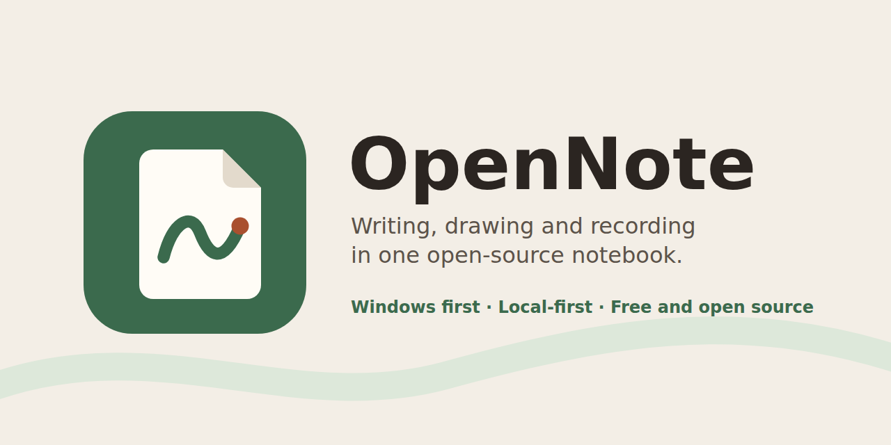

# OpenNote



An open-source note-taking application for Windows combining your favorite writing, drawing and recording features for professional and personal applications. Windows comes first; macOS, Linux, iOS and Android follow.

OpenNote is in the planning stage. No app code exists yet.

## Documents

| Document | What it covers |
|---|---|
| [RESEARCH.md](RESEARCH.md) | Popular and rising note apps, the features people love, and the gaps OpenNote can fill |
| [DEVELOPMENT.md](DEVELOPMENT.md) | Step-by-step plan for the Windows prototype, with tests and release gates |
| [BRAND.md](BRAND.md) | Colors, type, layout, motion, accessibility and performance budgets |
| [Screens](docs/design/SCREENS.md) | Wireframes of each major screen, with sizes and keep-out zones |
| [FEATURES.md](FEATURES.md) | Feature spec: Office and Google, handwriting, transcripts, study tools and more |
| [CHECKS.md](CHECKS.md) | The quality gate every file change must pass |

## Contributing

You need Node.js 22.18 or newer.

```sh
npm install
npm run setup-hooks   # run CHECKS before every commit
npm run checks        # check your changes
```

CHECKS also runs in continuous integration on every push and pull request.
