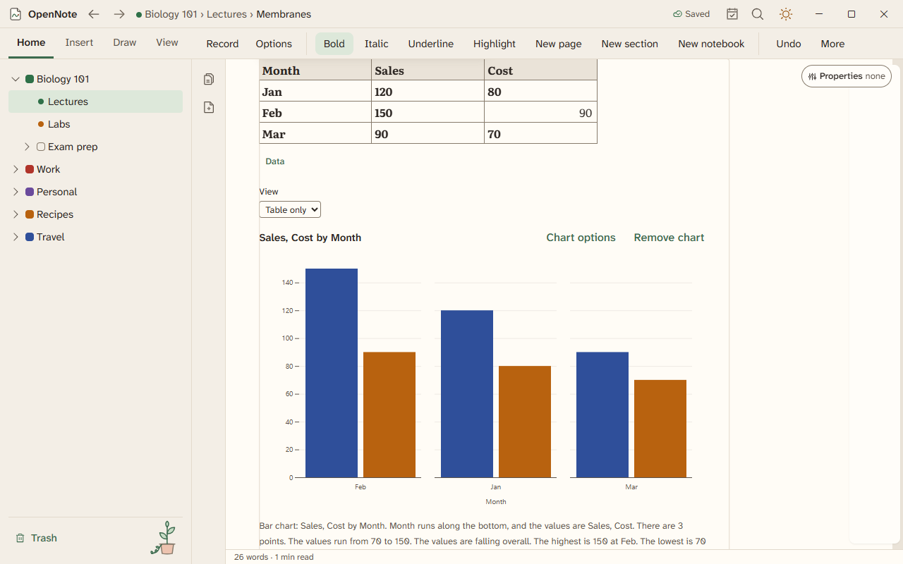
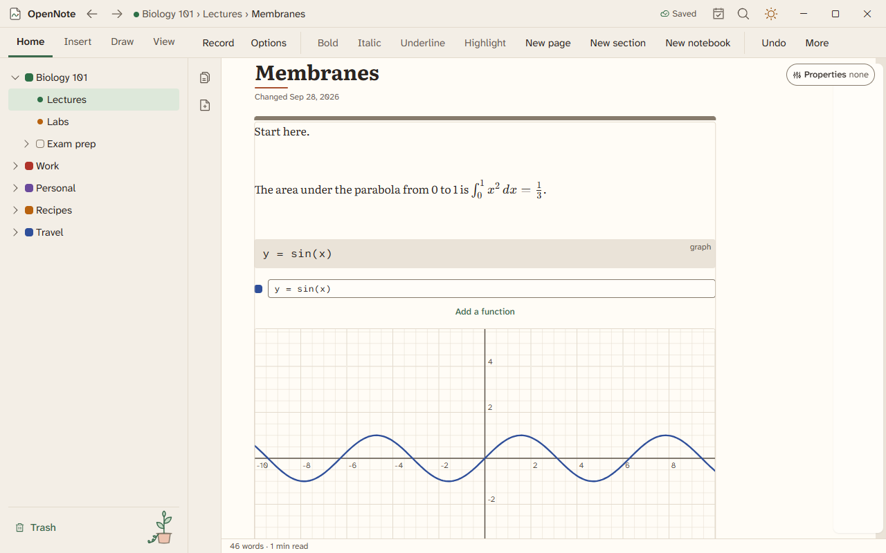

# OpenNote


OpenNote is an open-source note-taking app that combines your favorite writing, drawing, and recording features for professional and personal use. Windows comes first; macOS, Linux, iOS, and Android follow.

**New here?** The [help pages](docs/help/README.md) explain each part of the app. The [project wiki](https://github.com/XrxcGH/OpenNote/wiki) holds the user guide, development updates, and the developer guide.

## Status

OpenNote is in beta testing on Windows. Each phase of the [development plan](docs/DEVELOPMENT.md#5-phases) gets its own branch and merges into `main` when it meets its exit gate. Phases 5 to 14 are built and wait together on branch `beta` for their hand tests.

| Phase                                     | Focus                                                                                    | Status                                                                                                                     |
| ----------------------------------------- | ---------------------------------------------------------------------------------------- | -------------------------------------------------------------------------------------------------------------------------- |
| 0                                         | Project foundation                                                                       | Done and merged                                                                                                            |
| 1                                         | Spikes that test ink, text, PDF export, and audio                                        | Done and merged                                                                                                            |
| 2                                         | [App shell and navigation](https://github.com/XrxcGH/OpenNote/pull/8)                    | Done and merged 2026-10-02                                                                                                 |
| 3                                         | [Document model and storage](https://github.com/XrxcGH/OpenNote/pull/9)                  | Done and merged 2026-10-03                                                                                                 |
| 4                                         | [Typed notes (text, Markdown, tables, code)](https://github.com/XrxcGH/OpenNote/pull/15) | Done and merged 2026-10-03                                                                                                 |
| [5 to 12](docs/DEVELOPMENT.md#5-phases)   | Ink, page views and export, tables and charts, search, audio, math, import, intelligence | Built, and in beta testing on branch `beta` ([pull request #16](https://github.com/XrxcGH/OpenNote/pull/16), 0.1.0-beta.4) |
| [13 and 14](docs/DEVELOPMENT.md#5-phases) | Hardening and privacy; the release pipeline                                              | Built, waiting on the beta period, code signing, and the update key, which are the owner's                                 |

Agents compiled and unit-tested beta 4 and started the real app. Nobody has used most of it by hand yet. [docs/FEATURES.md](docs/FEATURES.md) marks every feature as built, built but untested by hand, not built yet, or needing the owner. The [changelog](CHANGELOG.md) lists what each beta added.

## What the app does today

OpenNote runs as a Windows desktop app. You organize notebooks, sections, and pages in a notes folder you choose, as plain folders in OpenNote's open note format. Pages save on their own and recover after a crash. Each area below has a help page.

| Area                                                              | What you can do                                                                                                |
| ----------------------------------------------------------------- | -------------------------------------------------------------------------------------------------------------- |
| [Typed notes](docs/help/typed-notes.md)                           | Text boxes, headings, lists, checklists, tables, code, callouts, Markdown, templates, and find and replace     |
| [Ink and palm rejection](docs/help/ink-and-palm-rejection.md)     | Pens, a highlighter, erasers, the lasso, shapes, and gestures, with your palm resting on the screen            |
| [Paper and page views](docs/help/paper-and-page-views.md)         | Flow, paginated, and canvas pages, with lined, grid, and dot paper that text sits on; slides, print, and PDF   |
| [Tables and charts](docs/help/tables-and-charts.md)               | Smart tables with views and formulas, and charts that update with them                                         |
| [Math and graphs](docs/help/math-and-graphs.md)                   | Equations, quick math, the grapher, Mermaid diagrams, and mind maps                                            |
| [Search and links](docs/help/search-and-links.md)                 | Search, page links, backlinks, tags, daily notes, and the graph view                                           |
| [Study tools](docs/help/study-tools.md)                           | Flashcards, Anki, study tape, Upcoming, timers, a calculator, and citations                                    |
| [Recording](docs/help/recording.md)                               | Recording with stamped notes, trim, transcript blocks, speakers, and meeting recaps                            |
| [Import and export](docs/help/import-and-export.md)               | Obsidian, Markdown, Word, Excel, PowerPoint, and more in; Markdown, Word, PDF, and more out                    |
| [On-device intelligence](docs/help/on-device-intelligence.md)     | Text in pictures, read aloud, summaries, Ask your notes, and writing tools, each off until turned on           |
| [Privacy and Work offline](docs/help/privacy-and-work-offline.md) | Crash reports with consent, a self-check, a feedback file, safe start, and a switch that stops all network use |
| [Connectors](docs/help/connectors.md)                             | Signing in to other services; no feature uses a connection yet                                                 |


| Ink                                                                                               | Lined paper                                                                                           | Tables and charts                                                                                       |
| ------------------------------------------------------------------------------------------------- | ----------------------------------------------------------------------------------------------------- | ------------------------------------------------------------------------------------------------------- |
|  |  |  |

| Math and graphs                                                                                            | Search                                                                                                    | Recording                                                                          |
| ---------------------------------------------------------------------------------------------------------- | --------------------------------------------------------------------------------------------------------- | ---------------------------------------------------------------------------------- |
|  |  |  |

Every screen is in [docs/screens](docs/screens/README.md), in light and dark. Not built yet in beta 4: the pen library, PDF import, the local API, the web clipper, and the speech engine for transcripts. The full list is in [docs/FEATURES.md](docs/FEATURES.md).

## Try the beta

There is no public release yet. The beta is one unsigned file, `OpenNote_Windows64.exe`, with no installer and no self-update. It is built from branch `beta`, as the [releasing guide](docs/RELEASING.md) describes for a release:

```sh
git switch beta
npm install
npx tauri build --no-bundle --target x86_64-pc-windows-msvc
```

The first build needs CMake for the audio encoder. [CONTRIBUTING.md](CONTRIBUTING.md) says where to find it. When you run the file, Windows SmartScreen warns about an unknown publisher. Choose More info, then Run anyway.

Test with a throwaway profile so your real notes stay safe. Set `OPENNOTE_PROFILE_DIR` to an empty folder before you start the exe. The [beta 4 hand test checklist](docs/testing/beta-4-checklist.md) has the exact commands and a list of steps for every area. Report a problem with Help, then Send feedback, which builds a file with the log and a self-check.

## Downloads

There is no release yet. When one ships, it will appear on the [GitHub Releases page](https://github.com/XrxcGH/OpenNote/releases) as three files:

| File                        | For                                            |
| --------------------------- | ---------------------------------------------- |
| `OpenNote_Windows64.exe`    | 64-bit Windows, on most PCs                    |
| `OpenNote_Windows32.exe`    | 32-bit Windows                                 |
| `OpenNote_WindowsARM64.exe` | Windows on Arm PCs, such as Snapdragon laptops |

## Quick start for contributors

On Windows, install Node.js 22.18 or newer, Rust (through rustup), and the Microsoft C++ Build Tools. Then run:

```sh
git clone https://github.com/XrxcGH/OpenNote.git
cd OpenNote
npm install && npm start
```

That opens the OpenNote window in development mode. Run `npm run setup-hooks` once, so CHECKS runs before every commit. To test your changes, run:

```sh
npm test                 # CHECKS, lint rule, and unit tests
npm run test:components  # component tests in the installed Edge or Chrome
npm run test:ui          # screen and accessibility tests in Playwright
npm run test:e2e         # real-app tests, which need tauri-driver and msedgedriver
npm run perf:typing      # the typing latency benchmark
cargo test --workspace   # Rust tests
```

[CONTRIBUTING.md](CONTRIBUTING.md) has the full setup, every npm script, and the workflow for branches and pull requests.

## Repository map

```text
app/           The desktop app
  src/         TypeScript and React interface
    core/      Interface-side models: ink, audio, page layout and rules
    editor/    The typed notes editor: schema, Markdown, tables, and highlighting
    features/  One folder per feature, each with a README: page, pages (views, paper, export), ink,
               tables, math, study, tools, search, audio, interop, intel, diagnostics, connectors,
               qol (shell extras), tree, settings, setup, and more
    services/  The notes and page service contracts, with their Tauri and in-memory versions
    shell/     The window, panes, command bar, and title bar
    strings/   Every word the interface shows, ready for translation
  src-tauri/   Rust shell, built on Tauri 2: commands for notes, search, audio, import and export,
               intelligence, diagnostics, connectors, and the shell extras
brand/         Design tokens, logo, app icon, and the social preview
checks/        The CHECKS quality gate
crates/        Rust libraries
  core/        Document model, file format, storage, undo, and search (Phase 3)
  crashreport/ Crash reports with consent and scrubbing (Phase 13)
  diagnostics/ The self-check and the feedback file (Phase 13)
  intel/       On-device intelligence through Windows (Phase 12)
  interop/     Import and export of other apps' formats (Phase 11)
  media/       Recording, Opus encoding, and playback (Phase 9)
  search/      The search index (Phase 8)
  updater/     Self-updater (fetch, verify, install, rollback)
docs/          Plans, specs, guides, and pictures
  adr/         Architecture decision records
  design/      Screen wireframes and the generator that draws them
  format/      Note file format specification and tools
  help/        Plain guides for using the app, one for each area
  perf/        Performance records for the phases
  releases/    Release sign-off files
  screens/     Real screenshots of every screen, in light and dark
  testing/     Hand test checklists: the beta, palm rejection, and keyboard and screen reader
spikes/        Throwaway Phase 1 experiments and their results
tests/         End-to-end, UI, performance, and crash tests
  crash/       Crash safety tests that kill the app during saves
  e2e/         Real-app tests: the smoke set (keyboard, screen reader) and typed notes
  perf/        Performance benchmarks for every budget
    typing/    The typing latency benchmark for the 20-page note (Phase 4)
  ui/          Screenshot tests of every screen and size
.github/       Issue and pull request templates, and the CI and release workflows
```

The root also holds tool settings such as `package.json`, `Cargo.toml`, and `checks.config.json`.

## Documentation

The [documentation index](docs/README.md) lists everything in `docs/`. Start with the help pages to use the app, or pick a document below.

| Document                                                             | What it covers                                                                         |
| -------------------------------------------------------------------- | -------------------------------------------------------------------------------------- |
| [Help pages](docs/help/README.md)                                    | How to use each part of the app, with screenshots                                      |
| [Project wiki](https://github.com/XrxcGH/OpenNote/wiki)              | The user guide, development updates, and the developer guide                           |
| [CHANGELOG.md](CHANGELOG.md)                                         | What each beta added, changed, and fixed                                               |
| [docs/DEVELOPMENT.md](docs/DEVELOPMENT.md)                           | The step-by-step plan for the Windows prototype, with a beta 4 status under each phase |
| [docs/FEATURES.md](docs/FEATURES.md)                                 | The feature spec, with what is built, untested, not built, or waiting on the owner     |
| [docs/RESEARCH.md](docs/RESEARCH.md)                                 | Popular and rising note apps, the features people love, and the gaps OpenNote can fill |
| [docs/BRAND.md](docs/BRAND.md)                                       | Colors, type, layout, motion, accessibility, and performance budgets                   |
| [docs/design/SCREENS.md](docs/design/SCREENS.md)                     | Wireframes of each major screen, with sizes and keep-out zones                         |
| [docs/screens/README.md](docs/screens/README.md)                     | Real screenshots of every screen, in light and dark                                    |
| [docs/CHECKS.md](docs/CHECKS.md)                                     | The quality gate every file change must pass                                           |
| [docs/format/README.md](docs/format/README.md)                       | The note file format specification and tools                                           |
| [docs/adr/README.md](docs/adr/README.md)                             | Every architecture decision record (ADR), its status, and how to write one             |
| [docs/testing/beta-4-checklist.md](docs/testing/beta-4-checklist.md) | The hand test checklist for beta 4, starting with the safest way to run it             |
| [docs/HARDENING.md](docs/HARDENING.md)                               | Crash reports, the self-check, the feedback file, and safe start                       |
| [docs/RELEASING.md](docs/RELEASING.md)                               | The maintainer guide to cutting, checking, and rolling back a release                  |
| [docs/CONNECTORS.md](docs/CONNECTORS.md)                             | Registering OpenNote with each connected service, and where the client IDs go          |
| [CONTRIBUTING.md](CONTRIBUTING.md)                                   | How to set up, make a change, and get it merged                                        |
| [SECURITY.md](SECURITY.md)                                           | How to report a security problem privately                                             |
| [CODE_OF_CONDUCT.md](CODE_OF_CONDUCT.md)                             | How we treat each other                                                                |

## License

OpenNote is licensed under the [Apache License 2.0](LICENSE).
