# OpenNote screens

These wireframes show the layout of each major screen, with sizes, keep-out zones, and the rules behind them. They follow [BRAND.md](../BRAND.md) and use its exact colors from [`brand/tokens.json`](../../brand/tokens.json). They are layout guides, not pixel-perfect mockups: icons are placeholders, and gray bars stand in for text.

They were redrawn for beta 4 to match the app as built. For real pictures of every screen, in the light and the dark theme, see [the screenshots](../screens/README.md).

## Contents

- [Reading the drawings](#reading-the-drawings)
- [The brand look](#the-brand-look)
- [First run](#first-run)
- [A new page](#a-new-page)
- [The page editor](#the-page-editor)
- [Drawing and ink](#drawing-and-ink)
- [Page views and paper](#page-views-and-paper)
- [Tables and charts](#tables-and-charts)
- [Math and graphs](#math-and-graphs)
- [Organizing notebooks](#organizing-notebooks)
- [Paginated view](#paginated-view)
- [Recording](#recording)
- [Search, commands, and links](#search-commands-and-links)
- [Import and export](#import-and-export)
- [Settings](#settings)
- [Tool windows](#tool-windows)
- [Size classes](#size-classes)
- [Phone](#phone)
- [Study tools](#study-tools)
- [Send to](#send-to)
- [Crash reports](#crash-reports)
- [Check OpenNote](#check-opennote)
- [Send feedback](#send-feedback)
- [Start in safe mode](#start-in-safe-mode)
- [Changing the drawings](#changing-the-drawings)

## Reading the drawings

- **Magenta hatching** marks a keep-out zone. Nothing interactive or important may be placed there, because the system or another control owns that space.
- **Violet dashed outlines** mark layout regions, with sizes in pixels at 100% display scaling.
- Desktop screens are drawn at 1440 × 900, the "wide" size class.

Keep-out zones that apply to every desktop screen:

| Zone | Size | Why |
|---|---|---|
| Window buttons | 138 × 40, top right | Windows draws minimize, maximize, and close here. Hovering maximize opens Snap Layouts. |
| Title bar drag area | At least 200 px wide | People must always be able to grab the window to move it |
| Compact title bar | Drag area and window buttons only | The theme toggle and other items move to the app bar below, so the drag area stays wide. Setup shows the logo, the name, the drag area, and the window buttons |
| Pane resize handles | 8 px wide | Dragging the divider resizes a pane, so nothing clickable may sit on it |

## The brand look

OpenNote should feel like a good desk by a window. The wireframes draw that look in three places:

| Part of the look | Where it appears |
|---|---|
| The desk scene: a window with a vine, a plant, books, an open notebook, and two candles | The welcome step, empty states, and About. Drawings sit beside the work and never on text. |
| The ambient canvas: window light pooling from the top left corner by day, a dusk sky with a few stars in the evening | Around the page card. The card itself stays plain paper. The setup backdrop keeps only the pool of light. |
| A small plant in a pot | The foot of the notebooks pane, beside Trash. |

The window in every desktop drawing has the same parts:

| Part | What it holds |
|---|---|
| Title bar | The logo, back and forward arrows, a breadcrumb that starts with the notebook's color, the save status, Upcoming, search, and the theme toggle, then the window buttons. |
| Command bar | Home, Insert, Draw, and View tabs, with the active tab's tools to the right. Tools that do not fit move under More. |
| Notebooks pane (272, resizable 220 to 400) | Notebooks, section groups, and sections, each with a color. Trash and the plant are at the foot. Settings opens with Ctrl+, (comma). |
| Pages pane (300, resizable 240 to 420) | Pages in the selected section, each with its changed date. Subpages are indented. |
| Page | The page card on the canvas, with a Properties chip at the top right and a status line with the word count and reading time. |

## First run

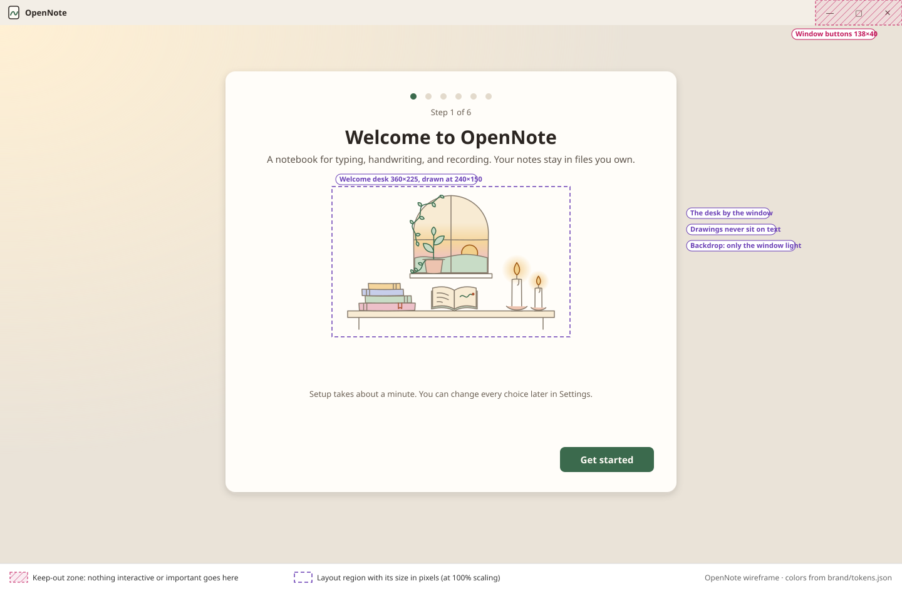

Setup has six short steps in a centered 720 × 672 card:

1. **Welcome:** what OpenNote is, in one sentence, over the desk scene (shown above).
2. **Choose your look:** Light, Dark, or Match Windows (shown below). Match Windows is selected in advance, with a caption that names the Windows setting. Clicking a card repaints the whole screen at once.
3. **On-device intelligence:** Recommended, Custom, or Not now (see [FEATURES.md](../FEATURES.md)). Not now is selected in advance, and nothing downloads until the person chooses it.
4. **Keys and pen:** the OpenNote or OneNote shortcut set, and a button that opens Windows pen settings for the pen's top button.
5. **Where to keep things:** the notes folder, where the app lives, and the first notebook.
6. **Bring in your notes:** start with a new notebook, or open the Import window when setup is done.

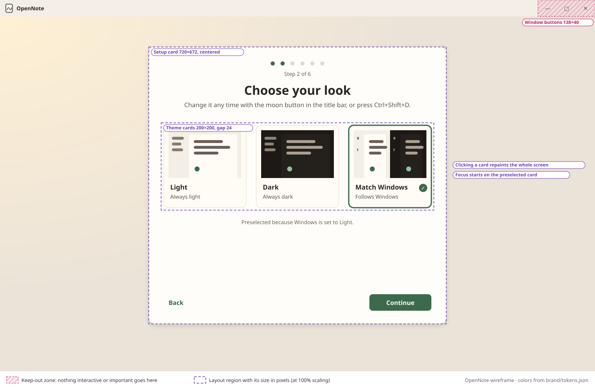

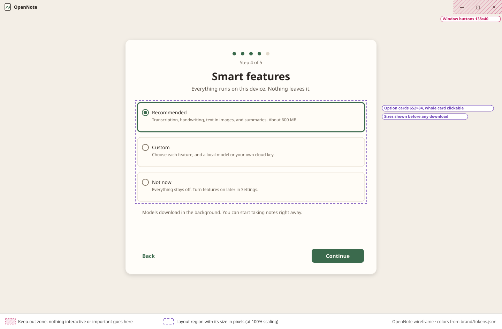

Step 3 lists each option as a full-width card, with the model's download size shown before anything downloads.

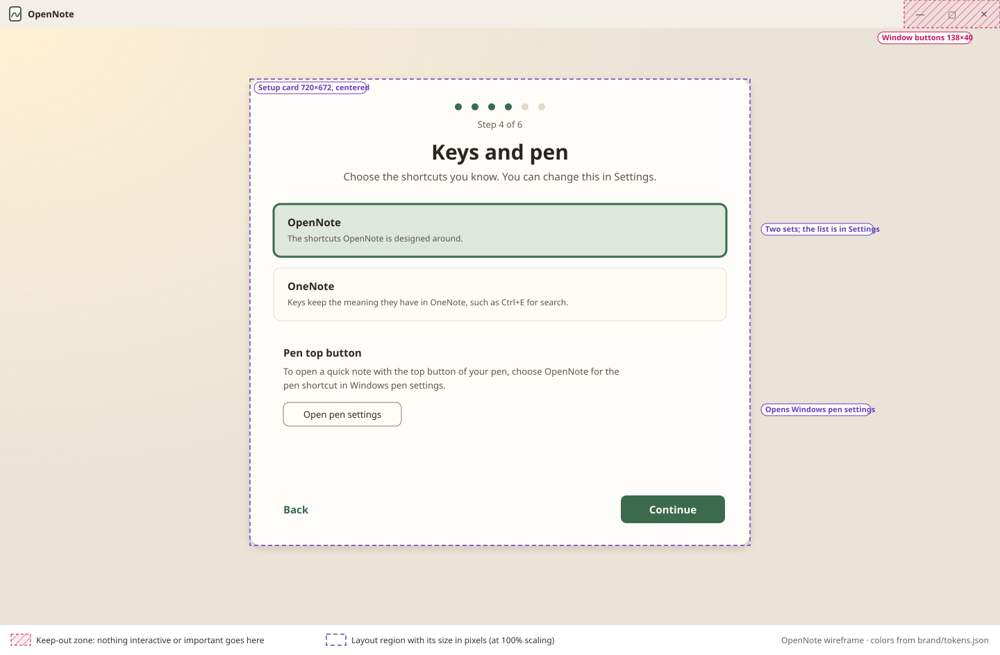

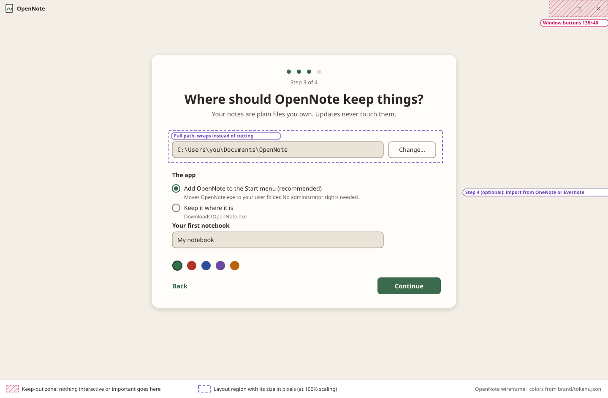

Paths are shown in full and wrap onto a second line rather than being cut in the middle. Back never loses what was entered.

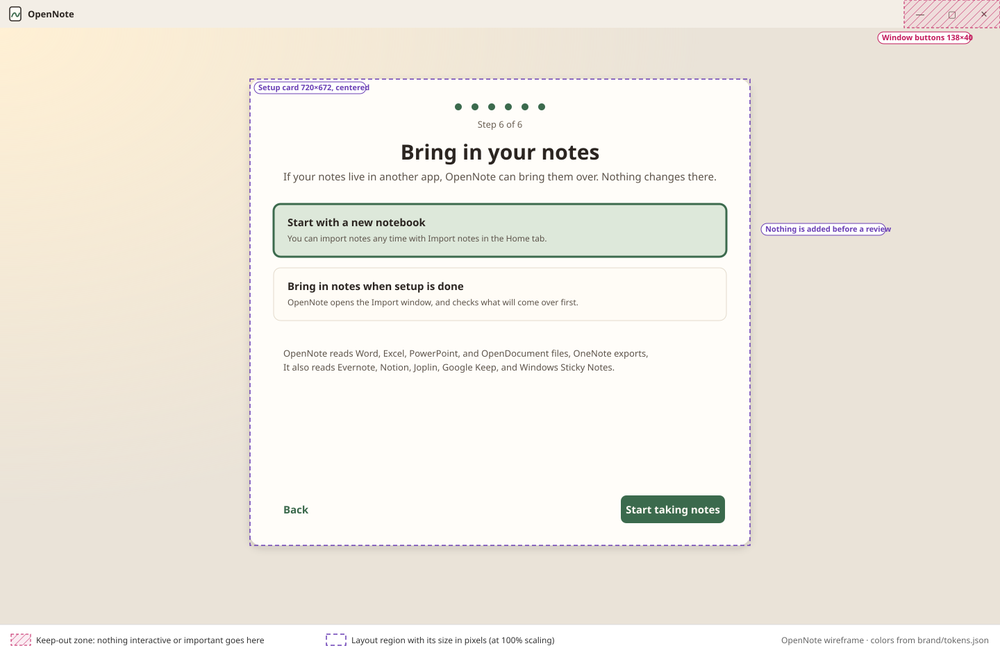

## A new page

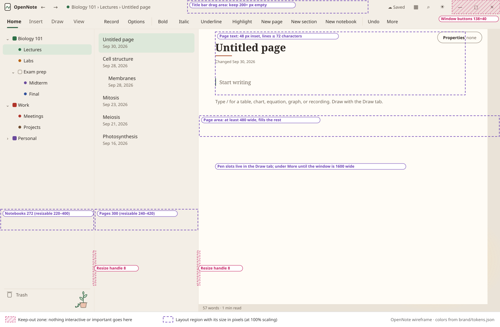

- **Title bar and command bar:** as described in [the brand look](#the-brand-look).
- **Page:** fills the rest and is never narrower than 480. Text starts 48 px in, and lines stop at 72 characters.
- **Pen slots:** live in the Draw tab. Below 1600 px they sit under More, then Pen.

The same screen in the dark theme, with the dusk sky and stars:

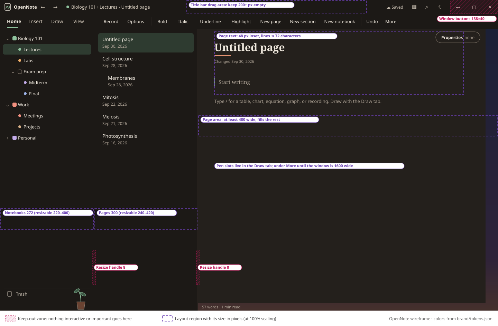

## The page editor

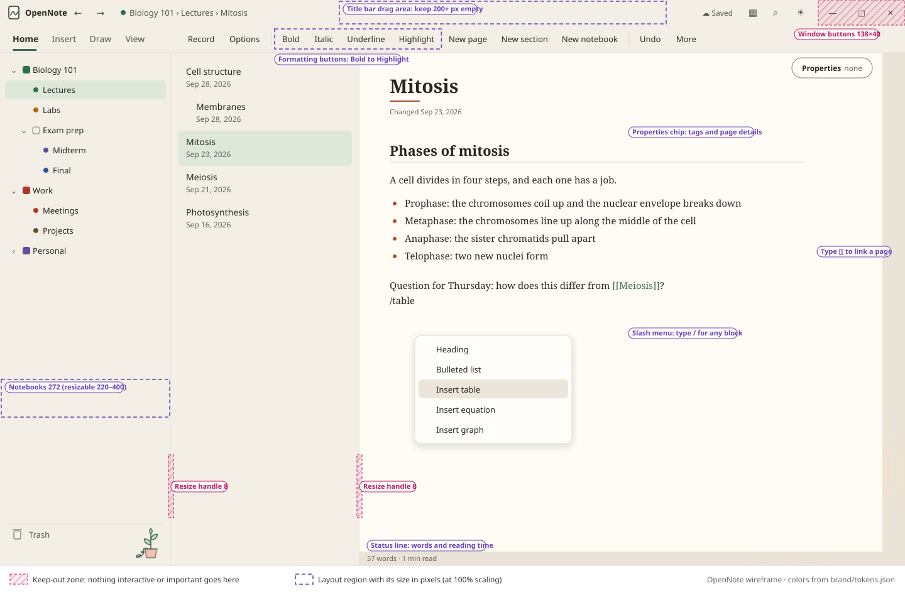

- **Home tab:** Record and Options, then the formatting buttons (Bold, Italic, Underline, Highlight) while the caret is in text, then New page, New section, New notebook, Undo, and More.
- **Typing:** Markdown shortcuts work as you type. A hash and a space make a heading, and a dash and a space make a list.
- **Slash menu:** type a slash at the start of a line to add a table, equation, graph, code block, callout, or recording.
- **Page links:** typing two square brackets lists pages. A link shows whether its page exists.
- **Properties chip:** tags and page details, at the top right of the page.
- **Status line:** words and reading time, at the foot of the page.

## Drawing and ink

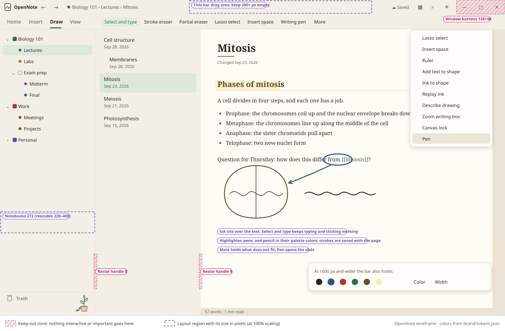

- **Draw tab:** Select and type, Stroke eraser, Partial eraser, Lasso select, Insert space, and Writing pen, then More.
- **Pen slots:** seven slots (pens, a pencil, and highlighters), then Color and Width for the active one. At 1600 px and wider they sit in the bar. Narrower, they are under More, then Pen.
- **Select and type:** keeps the text under the ink easy to click and type into. Choosing a pen draws instead.
- **More:** Ruler, Add text to shape, Ink to shape, Replay ink, Describe drawing, Zoom writing box, and Canvas lock.

Ink is saved with the page, loads back when the page opens, and undo takes it away.

## Page views and paper

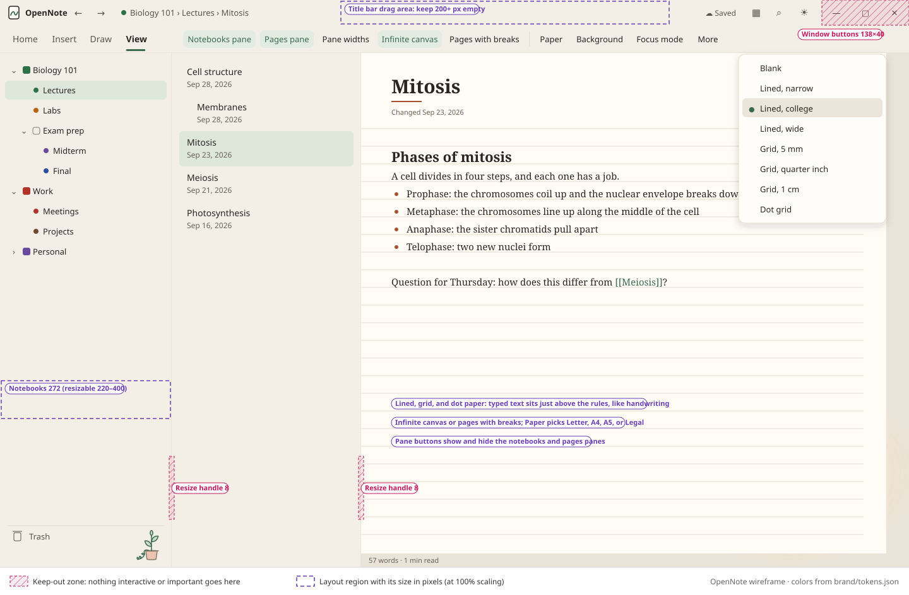

- **Pane buttons:** Notebooks pane and Pages pane show and hide the two panes. A hidden pages pane leaves a 48 px rail.
- **Layout:** Infinite canvas, or Pages with breaks at Letter, A4, A5, or Legal size.
- **Background:** Blank, Lined (narrow, college, or wide), Grid (5 mm, quarter inch, or 1 cm), or Dot grid.
- **Text on the rules:** on lined, grid, and dot paper, typed text sits on the rules the way handwriting does.
- **Pane widths and Focus mode:** Pane widths sets the pane sizes. Focus mode turns the calm writing view on or off.

## Tables and charts

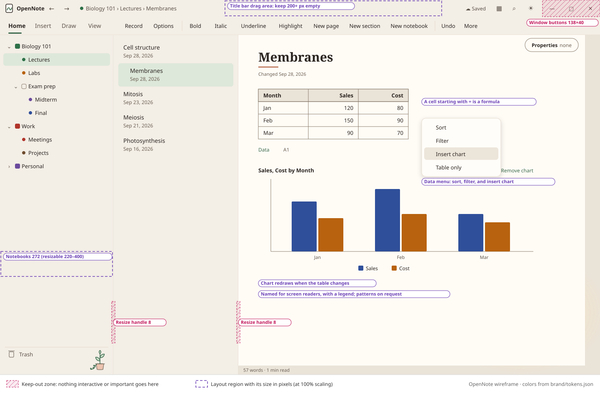

- **Smart table:** a cell that starts with an equals sign is a formula and shows its result. Results follow the data.
- **Data menu:** sort, filter, and Insert chart. A chart is made in two steps and draws below the table.
- **Chart:** follows the data as it is edited and takes the table's filter. Chart options changes the kind, adds patterns, or removes it.
- **Access:** the chart is named for screen readers, with a legend, so color is never the only signal.

## Math and graphs

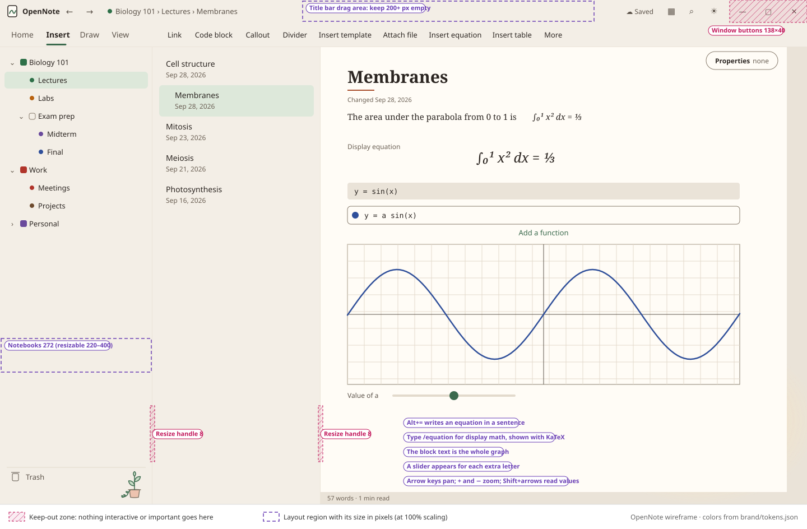

- **Equations:** Alt+= writes one inside a sentence. Type /equation for a display equation. The field shows a preview and names a mistake in the LaTeX.
- **Graph block:** type /graph. The block's text is the whole graph, with one function on each line.
- **Using the graph:** plus and minus zoom, the arrow keys pan, and Shift with the arrows reads a value and a slope.
- **Sliders:** each letter besides x in a function gets a slider.

## Organizing notebooks

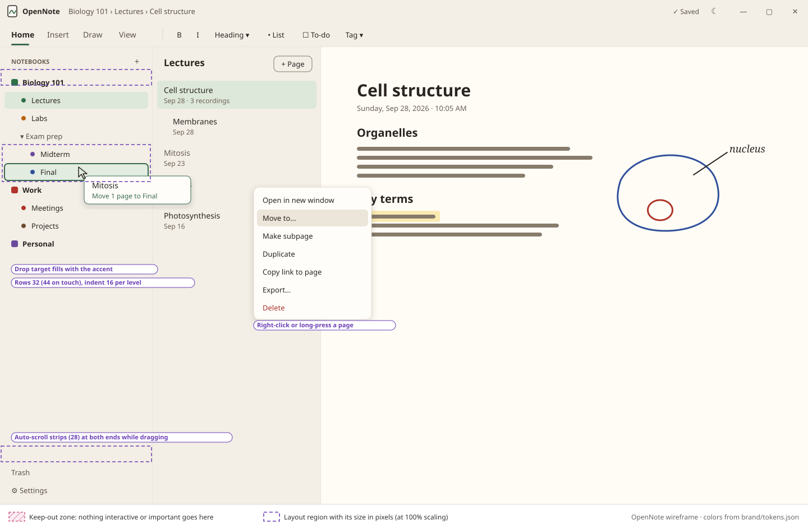

Two interactions are shown together here:

- **Drag and drop:** pages can be dragged onto any section, and sections onto any notebook. The target fills with the accent color, and a label on the dragged card says what will happen ("Move 1 page to Final"). Lists scroll by themselves when the pointer reaches the 28 px strips at either end.
- **Right-click or long-press** a page for Move to, Make subpage, Duplicate, Copy link, Export, and Delete. Delete sits last, in red, away from common actions.

Tree rows are 32 px tall with a pointer and 44 px on touch, indented 16 px per level. Keyboard users can move items with Ctrl+Shift+Up and Ctrl+Shift+Down.

## Paginated view

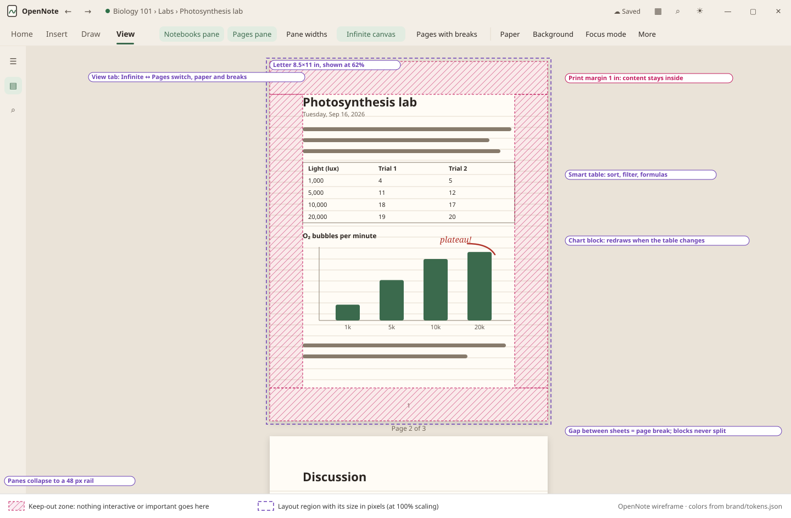

The View tab switches any page between the infinite canvas and pages with breaks. With breaks:

- Pages are shown as sheets on the sunken background, at the chosen paper size (Letter here).
- The print margins are keep-out zones. Content placed there moves inside when the page is paginated.
- The gap between sheets is the page break, labeled with the sheet number. Tables, charts, and images never split across pages. They move to the next page whole.
- Tables and charts are live blocks. Editing the table redraws the chart.
- The side panes collapse to a 48 px rail to give the page more room.

What you see here is exactly what prints or exports to PDF.

## Recording

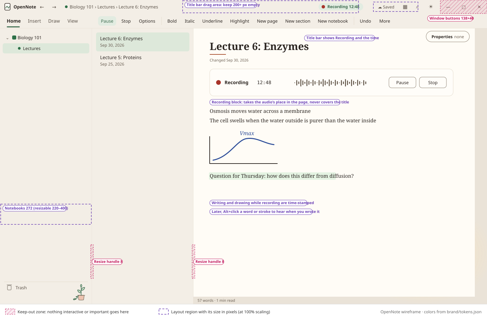

- **Title bar indicator:** shows "Recording" and the time while a recording runs. Selecting it opens the recording controls.
- **Home tab:** while recording, Pause and Stop take the place of Record.
- **Recording block:** takes the audio's place in the page, with the recording dot, the time, a level meter, and Pause and Stop. It never covers the page title.
- **Time stamps:** what you write or draw while recording is time-stamped. Later, Alt+click a word to hear when you wrote it.

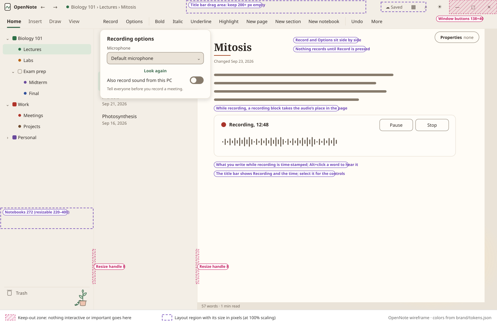

Options sits beside Record. It picks the microphone, offers to also record sound from this PC for meetings, and reminds the person to tell everyone before recording a meeting. Nothing records until Record is pressed.

After a recording stops, the block becomes a player with Play, speed, a position slider, flags, and Trim silence.

## Search, commands, and links

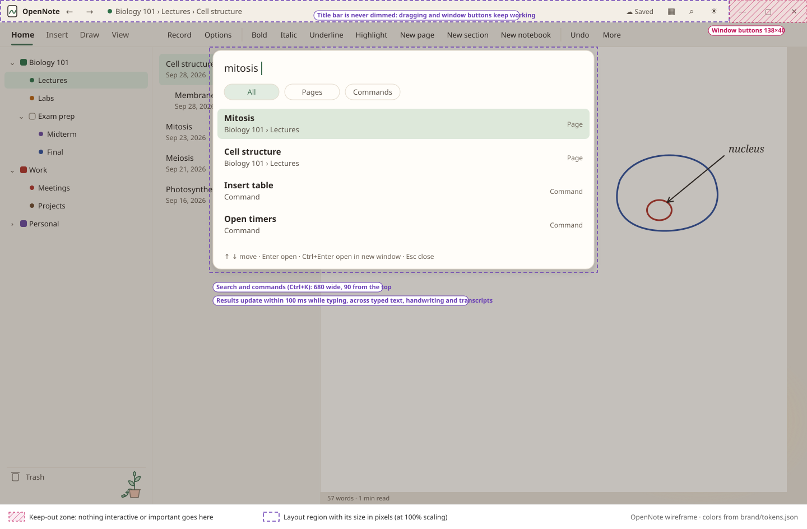

Ctrl+K opens one box for both pages and commands. It is 680 px wide and sits 90 px from the top, so the page stays visible below. Filter chips narrow the list to pages or commands. The title bar is never dimmed, so the window can still be moved or closed.

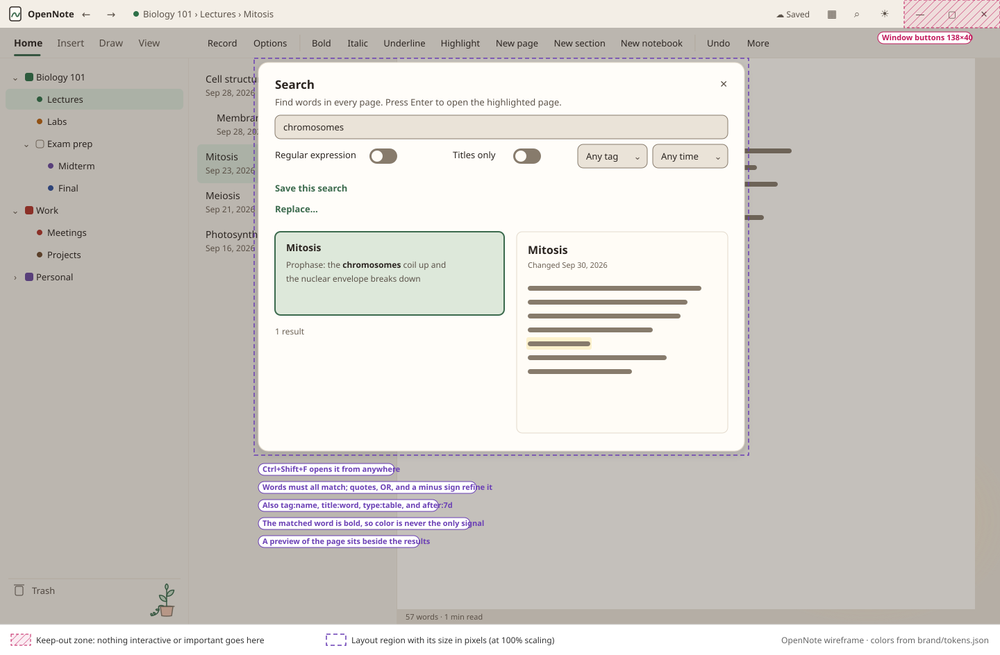

Ctrl+Shift+F opens the search panel. It finds words in the text of every page.

- Words must all match. Quotes find a phrase, `OR` between two words finds either one, and a minus sign leaves a word out.
- Operators such as tag:name, title:word, type:table, and after:7d narrow the search further. Switches limit it to titles or use a regular expression.
- The matched word is bold, so a match never rests on color alone. A preview of the page sits beside the results.

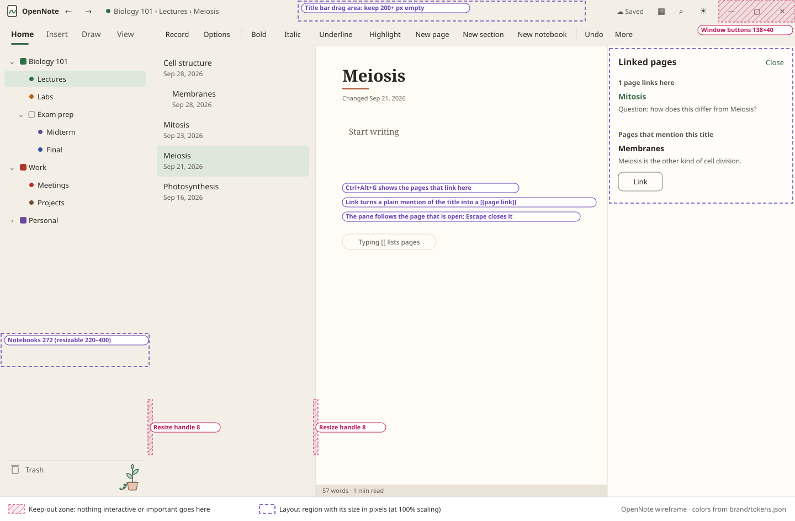

Ctrl+Alt+G shows the pages that link to the open page, and the pages that say its title without linking it. Link turns a mention into a page link. The pane follows the open page, and Escape closes it.

## Import and export

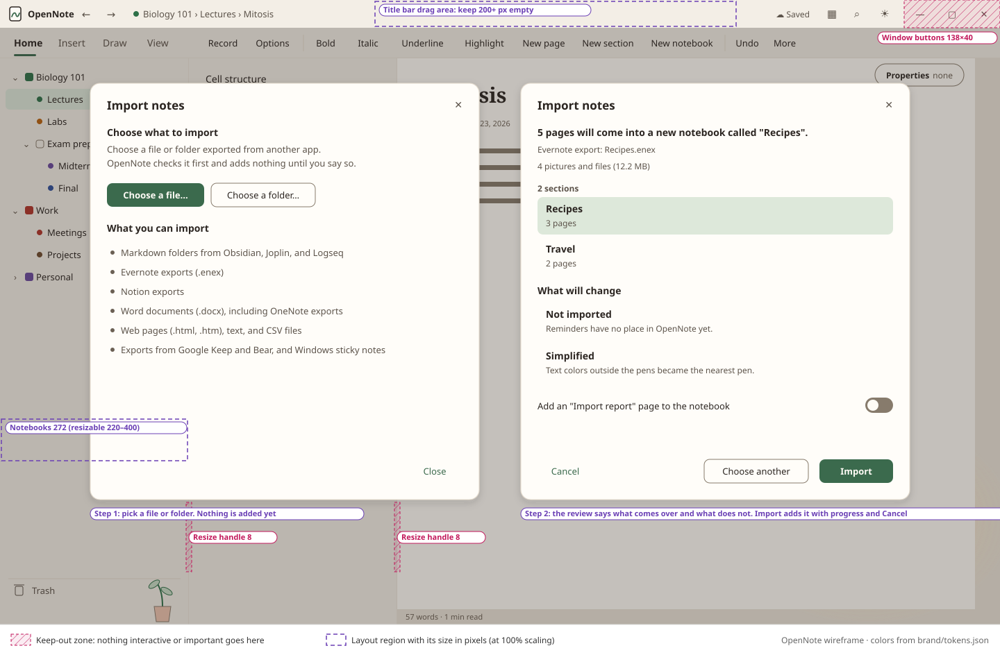

- **Choose:** a file or a folder from another app. OpenNote checks it first and adds nothing until the person says so.
- **Review:** says how many pages come into which new notebook, what does not come over, and what was simplified. An optional import report page can be added to the notebook.
- **Import:** runs with progress and Cancel, then offers to open the new notebook.

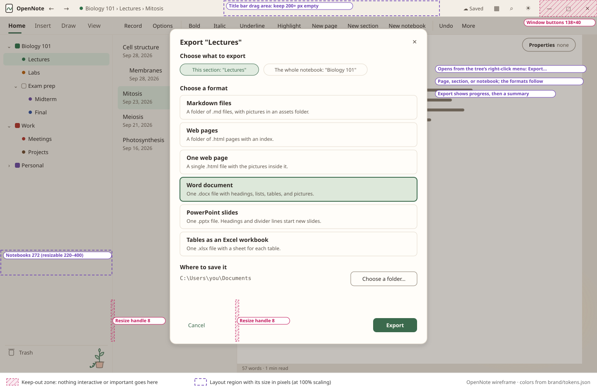

Export opens from the right-click menu on a page, section, or notebook. The person picks what to export, a format, and a folder. Formats include Markdown, web pages, Word, PowerPoint slides, and Excel tables. A summary follows the export.

## Settings

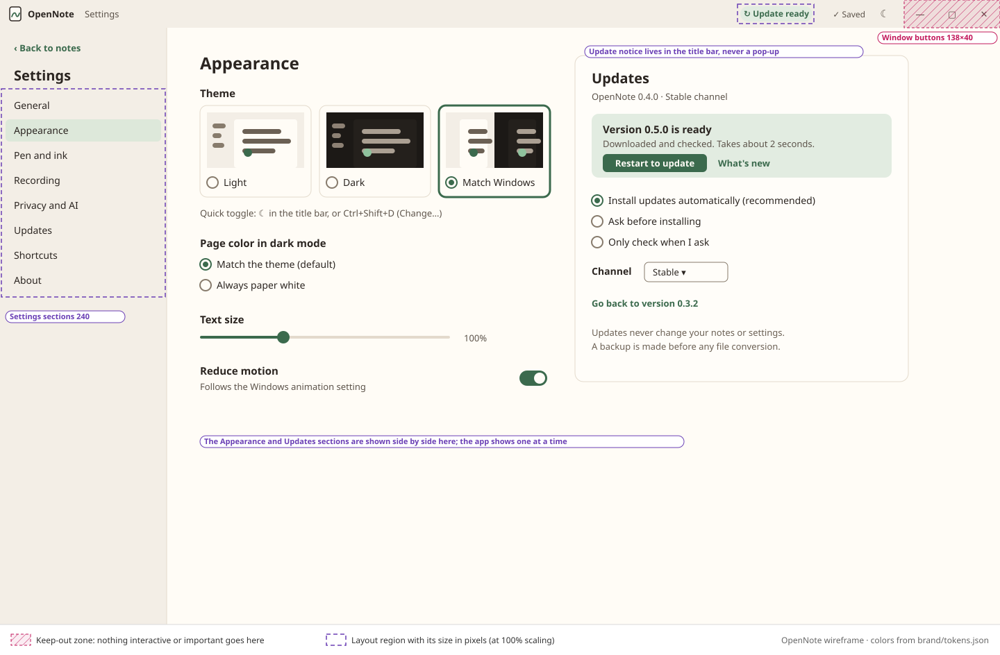

Settings replaces the workspace, with a "Back to notes" link at the top left. The section list has General, Appearance, Editing, Recording, On-device intelligence, Storage and backups, Updates, Privacy, Windows and power, Connectors, Help, Shortcuts, and About. The drawing shows two sections side by side for reference. The app shows one at a time.

- **Appearance:** theme (Light, Dark, Match Windows), page color in dark mode, text size, and interface size.
- **Updates:** a ready update with "Restart to update", install preference, channel, and a one-click way back to the previous version.

The "Update ready" notice appears in the title bar only. It never pops up or interrupts work.

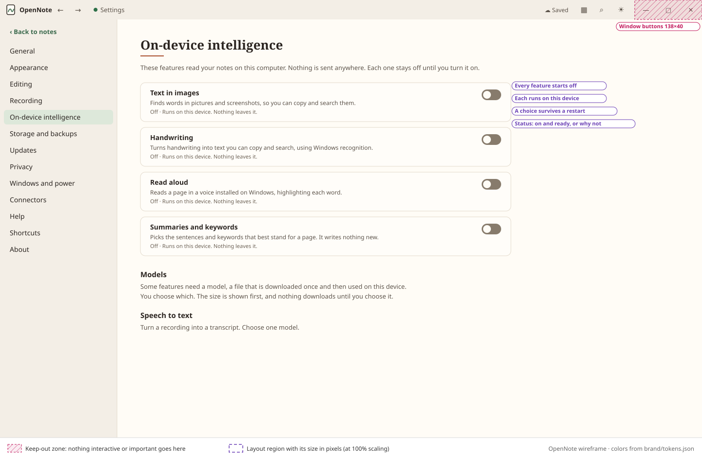

Every feature starts off: text in images, handwriting, read aloud, and summaries and keywords. Each says it runs on this device and nothing leaves it. Turning one on shows whether it is ready, or why not.

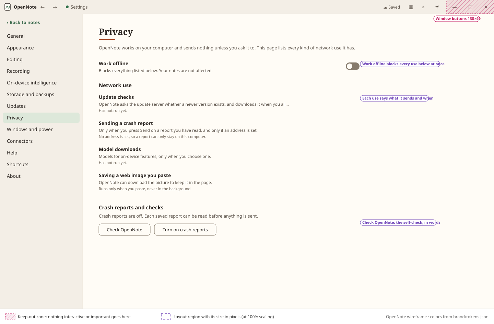

Privacy lists every kind of network use, such as update checks, crash reports, and model downloads. Each says what it does and when it last ran. Work offline blocks all of them at once. Crash reports and Check OpenNote are reached from this page.

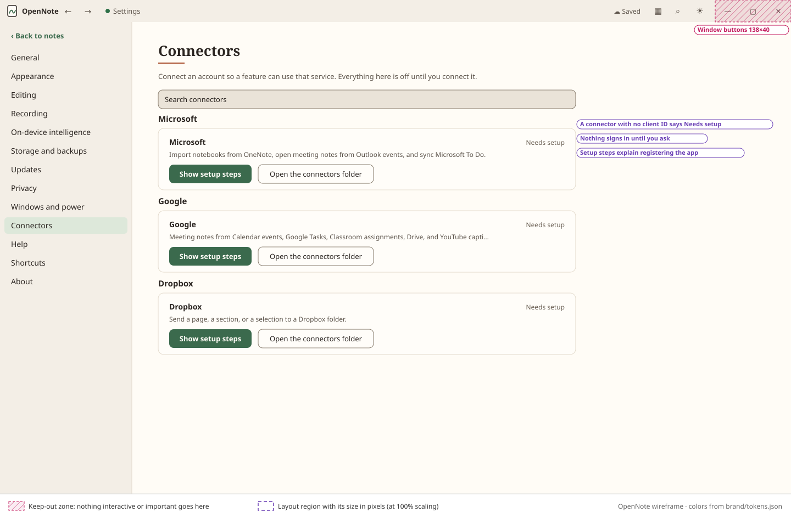

Connectors lists the accounts that features can use, such as Microsoft, Google, and Dropbox. A connector with no client ID says "Needs setup", and Show setup steps explains how to register the app. Nothing signs in until the person asks.

## Tool windows

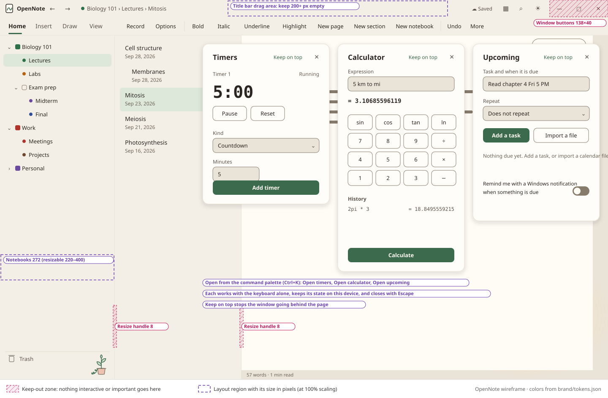

Timers, the calculator, and Upcoming open from the command palette as small windows. Each works with the keyboard alone, keeps its state on this device, and closes with Escape. Keep on top stops a window going behind the page.

- **Timers:** countdown timers, with Start, Pause, and Reset. A timer is still there after a restart.
- **Calculator:** answers expressions, converts units (5 km to mi), and keeps a history.
- **Upcoming:** tasks and due dates, with repeats, a calendar file import, and an optional Windows notification.

## Size classes

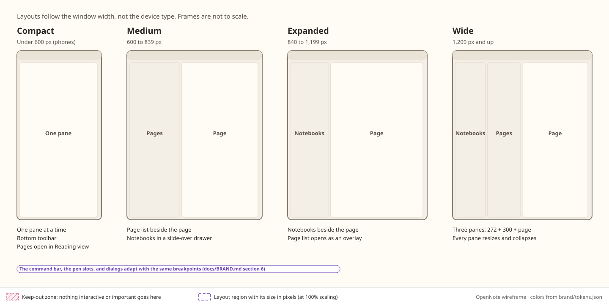

The layout follows the window width, as set out in [section 6 of the brand guide](../BRAND.md#6-space-size-and-layout). Snapping OpenNote to half of a laptop screen gives the medium layout, and a phone always gets the compact one.

## Phone

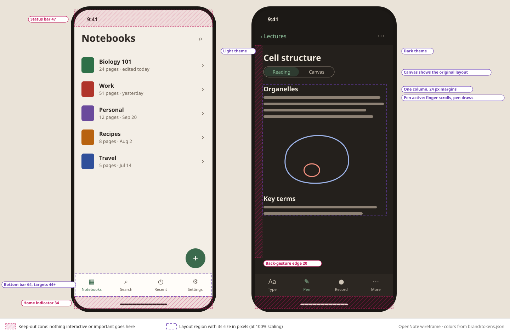

- One pane at a time, with a bottom bar whose targets are at least 44 × 44.
- The status bar (47), home indicator (34) and left-edge back gesture (20) are keep-out zones.
- Freeform pages open in **Reading** view, where blocks flow in one column with 24 px margins. **Canvas** shows the original layout with pinch-zoom.
- With the pen tool active, a finger scrolls, and only the pen draws.

## Study tools

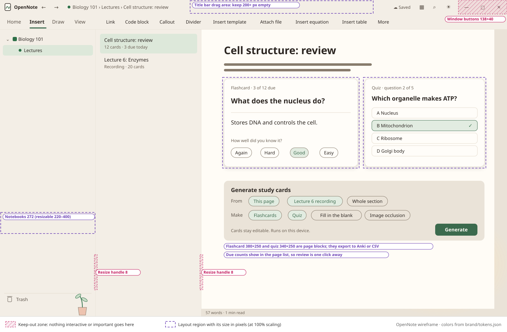

- **Flashcard block (380 × 250):** shows the question, then the answer, then Again, Hard, Good, and Easy buttons that schedule the next review.
- **Quiz block (340 × 250):** multiple choice with instant feedback, shown with a check mark on the right answer.
- **Generate panel:** picks sources (this page, a recording, or a whole section) and card types, then makes editable cards on the device.
- The page list shows how many cards are due, so review is one click away.

## Send to

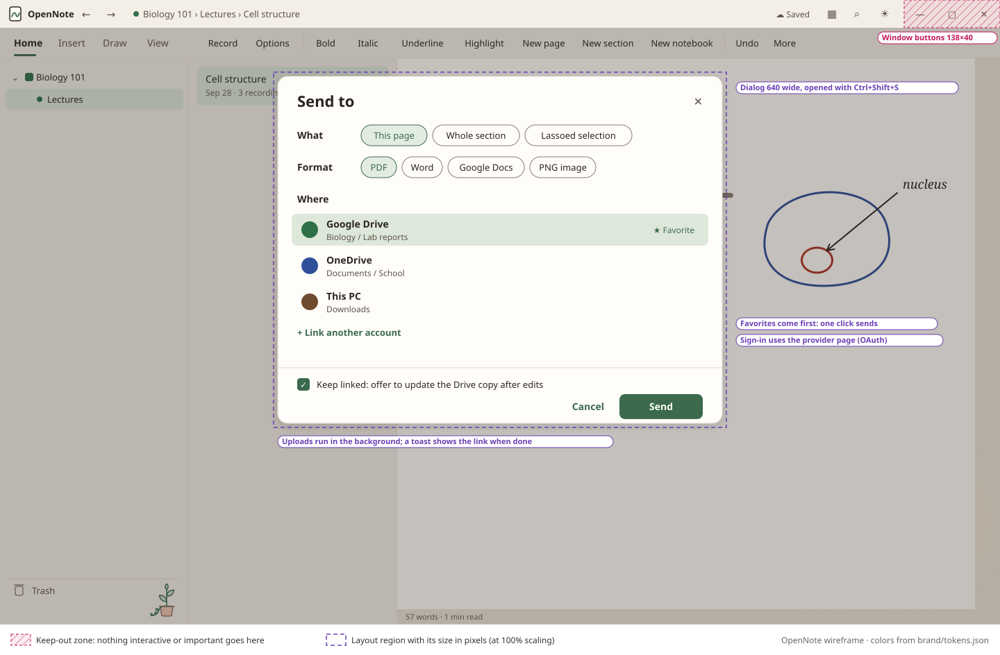

- Sends this page, the whole section, or a lassoed selection as PDF, Word, Google Docs, or a PNG image.
- Destinations come from linked accounts (Google Drive, OneDrive) or this PC, with favorites listed first.
- "Keep linked" lets OpenNote offer to update the uploaded copy after later edits.
- The upload runs in the background, and a toast shows the link when it finishes.

## Crash reports

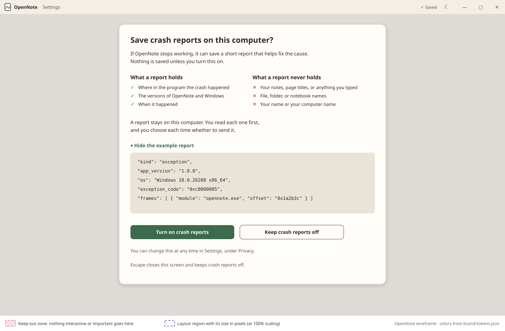

Crash reports are off until the person turns them on. The consent screen is a dialog with these rules:

- **When it shows:** once at the first start of a beta build, again only when the wording changes (a yes to older wording stops counting), and any time from Settings, under Privacy. It never returns after a no.
- **What it says:** what a report holds, what it never holds, and that a report stays on this computer until the person reads it and chooses to send it. The example report is a real report in the real format, and it is hidden until the person opens it.
- **The choices:** "Turn on crash reports" and "Keep crash reports off" are buttons of the same size and weight. Neither is pre-selected. Escape and the close button mean no.
- **Keyboard and screen readers:** focus starts on the heading. The example is a labeled region with a read-only, selectable text block. The result is announced: "Crash reports are on. They stay on this computer." or "Crash reports are off."
- **Reviewing a report:** the list in Settings, under Privacy, shows each saved report with Review and Delete. Review shows all the text that would be sent, the address, and one Send button. Sending is never automatic, and a send in progress cannot be closed away.

The text is in `app/src/strings/en/diagnostics.ts`, and the states are in `app/src/features/diagnostics`.

## Check OpenNote

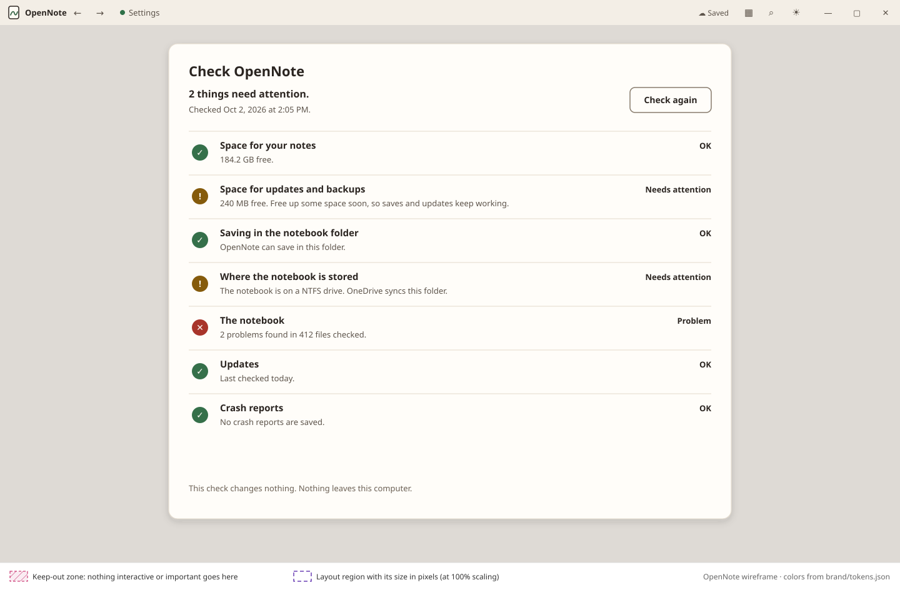

- Opens from Settings, under Privacy, and from the command palette. It runs when it opens and when "Check again" is chosen.
- A headline says how many checks need attention. Each row has an icon, a title, a status in words (OK, Needs attention, Problem, or Not checked), and one sentence. Color is never the only signal.
- Problems in the notebook list the first five files, relative to the notebook, and count the rest.
- It changes nothing, and nothing leaves the computer.

## Send feedback

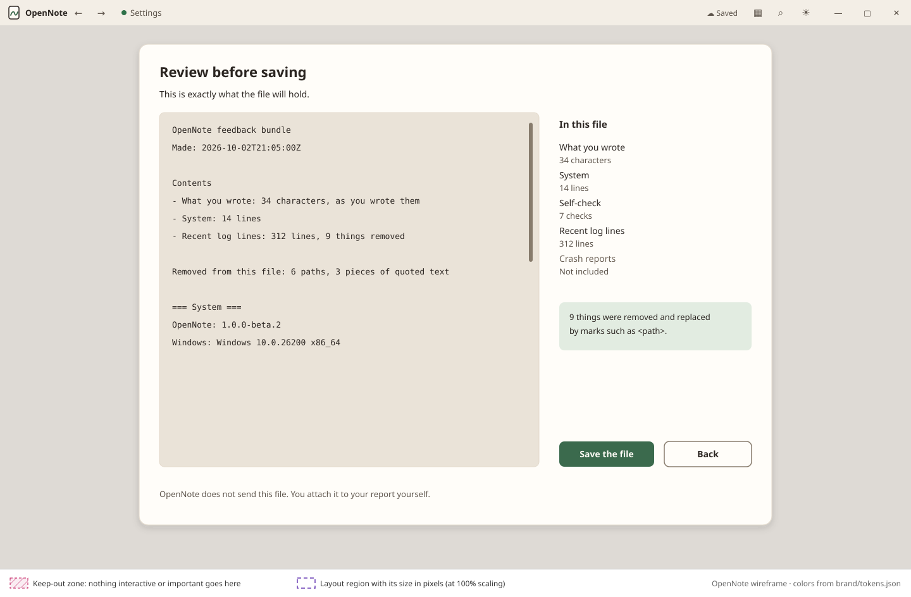

- **The form:** an optional description in the person's own words, and two switches: recent log lines (on) and saved crash reports (off).
- **The review:** the whole file, as a read-only text block, with the list of its parts on the right, and a line that says how many things were removed. Save is available only after the text is on screen.
- **Saving:** the person picks a folder, and the file is saved there. OpenNote does not send it. The person attaches it to their report or email.

## Start in safe mode

A dialog before the notebook opens, after two crashes in a row. It is text and two buttons, so it has no drawing.

- **What it says:** that OpenNote stopped working during its last starts, what safe mode turns off (background work, embeds, on-device models), and that notebooks stay open for reading and editing. After a crash in safe mode, it says that safe mode did not help and points to Send feedback.
- **The choices:** "Start in safe mode" and "Start normally" are buttons of the same size and weight, and neither is pre-selected. Escape and the close button mean "Start normally".
- **While safe mode is on:** a notice below the title bar says "OpenNote is in safe mode" in words, lists what is off, and has a "Restart normally" button. It stays until the next start.
- **Keyboard and screen readers:** focus starts on the heading. The choice is announced.
- **Counting sessions:** Check OpenNote and the Privacy panel show "9 of the last 10 sessions ended without a crash", from the same record.

The text is in `app/src/strings/en/diagnostics.ts`, and the states are in `app/src/features/diagnostics/safeStart.ts`.

## Changing the drawings

The drawings are generated by code in this folder, so they stay in step with the design tokens:

```sh
npm run design     # rebuild every SVG in docs/design/images
```

Each screen is a function in `docs/design/screens/`. Shared window parts live in `docs/design/lib/chrome.ts`, small interface parts such as buttons and dialogs in `docs/design/lib/parts.ts`, and drawing helpers in `docs/design/lib/svg.ts`. The desk scene and the plant are drawn in `docs/design/lib/drawings.ts` from the app's own outlines in `app/src/ui/illustrations/shapes.ts`. Draw every arrow with `arrow()` so it has a head, and run `npm run test:design` after changing a drawing. After changing `brand/tokens.json`, run `npm run design` and commit the updated images.
