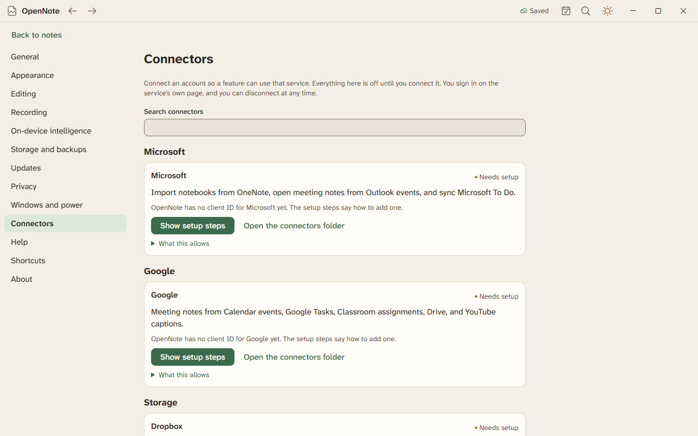

# Connectors

A connector signs OpenNote in to another service so a feature can use it. Everything is off until you connect it, and you can disconnect at any time.

## Connect a service

Open Settings, then Connectors. Each service has a card.

| Services | How you connect |
|---|---|
| Microsoft, Google, Slack, Dropbox, Box, and Vimeo | Choose Connect. The service's own sign-in page opens in your browser, never inside OpenNote. |
| Readwise, Canvas, and Moodle | Choose Connect and paste a personal token from your account. |

When a card says Connected, it shows the account name. Choose Disconnect to remove the connection. OpenNote then forgets the token.

## Where your tokens live

OpenNote keeps each token in Windows Credential Manager. It never writes one to a file, the log, or the feedback file. Work offline blocks connecting.

## Why a card says Needs setup

The six sign-in services need a client ID. A client ID says which app is asking for access. A copy of OpenNote that was built without them shows Needs setup on those cards. If you have a client ID, choose Add a client ID on the card, paste it, and save. The card then says Not connected and offers Connect. The [connectors guide](../CONNECTORS.md) tells the maintainer where to register and where else the IDs can go. Readwise, Canvas, and Moodle need no setup.

## What connectors do

Each feature below needs its account connected first. If it is not, the command tells you and offers a way to Settings.

### Sync Readwise

Connect Readwise with your token, then press Ctrl+K and choose Sync Readwise. OpenNote makes a notebook named Readwise with a section for each kind of reading, such as Books and Articles, and a page for each book. Each highlight is one block on the page, with your note, its place in the book, and its tags.

The first sync reads everything. Later syncs read only what changed since the last one. A highlight you edit at Readwise is updated on its page, and one you delete there is removed. Blocks you write yourself on a page are never changed. If Readwise asks OpenNote to slow down, what was synced so far stays, and you can sync again in a minute.
