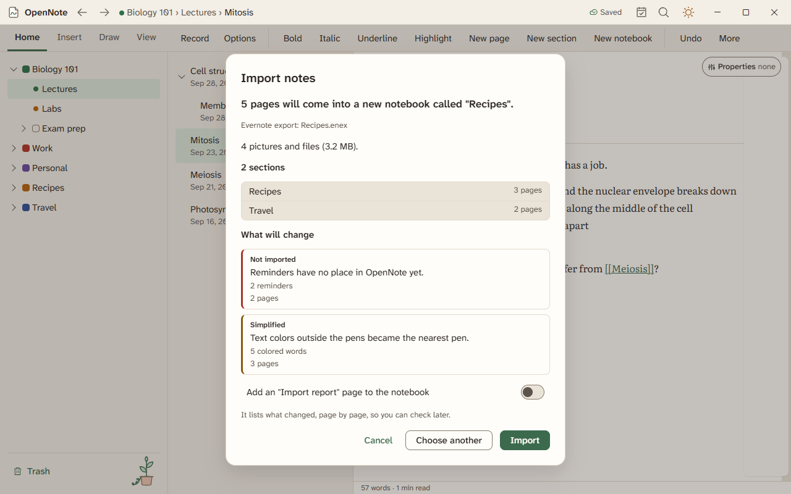
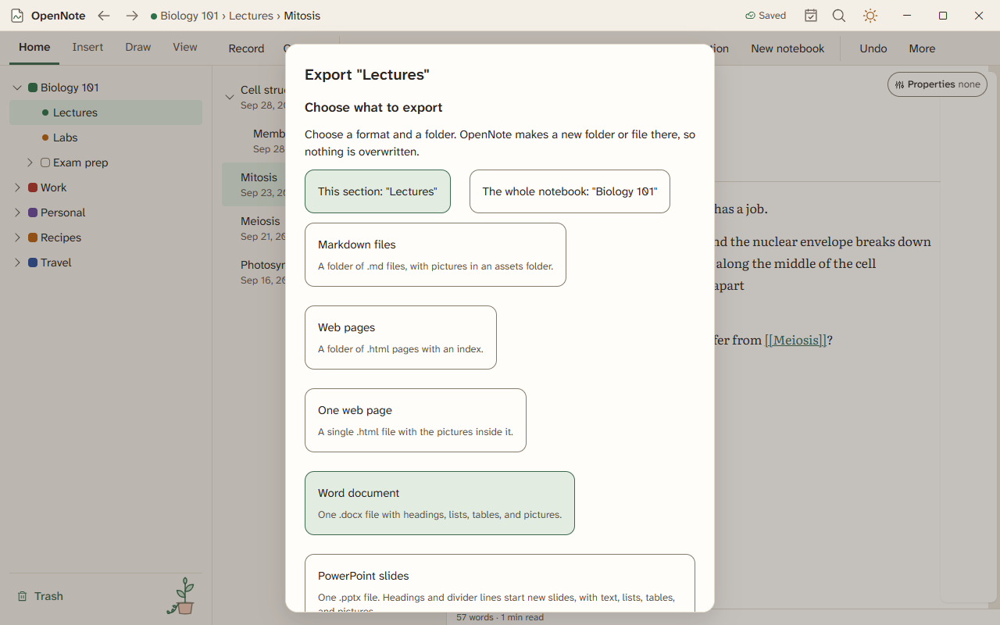

# Import and export

Bring notes in from other apps and take them out again. Your notes stay in plain files either way.

## Import

Press Ctrl+K and choose Import. First-time setup has the same step. Pick a source, then choose a file or folder.

| Source | What you get |
|---|---|
| An Obsidian vault or a folder of Markdown | A notebook with its pages |
| Word (`.docx`) and OpenDocument (`.odt`) | A page for each file |
| Excel (`.xlsx`) | Table pages |
| PowerPoint (`.pptx`) | One page for each slide |
| Email (`.eml`) | A page with its attachments |
| Kindle clippings and a Readwise CSV file | Your highlights |
| Windows Sticky Notes | Your notes and their pictures |
| A Notion export | Its pages, with each database as a smart table |

A Notion database keeps its column types. Numbers, money, dates, checkboxes, and short lists of choices are read from the cells, and the review names each typed column. A column with one value that does not fit stays as text.

Before anything is added, a review lists what comes over and what does not. Choose Save report to keep that list. Undo takes an import back.

## Export

Open Share, then Export, or press Ctrl+K and choose Export.

- Pages, sections, and whole notebooks export as Markdown, Word, or a single HTML file.
- Tables export as `.xlsx` or `.csv`. Pages export as a PowerPoint file.
- A page's own Export and Print menu makes a PDF. The PDF format is not in the Import and export dialog yet.
- Lasso an area to export just that part.

## Screenshots and copies

Take a screenshot with Win+Shift+S and OpenNote offers to add it to the open page. You can send copies of pages to favorite folders, then choose Update the copy after you edit.

## Not in beta 4

Share as a file is not finished and has no screen yet. Opening OneNote files, importing a PDF with space for notes, and the web clipper are not built.

Import and export are built. Agents opened each dialog once. Nobody has tried a real import by hand.
