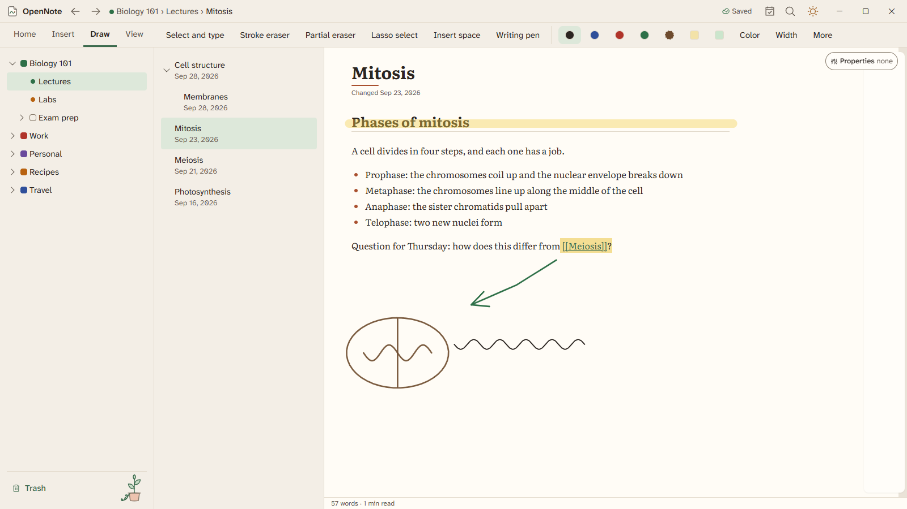
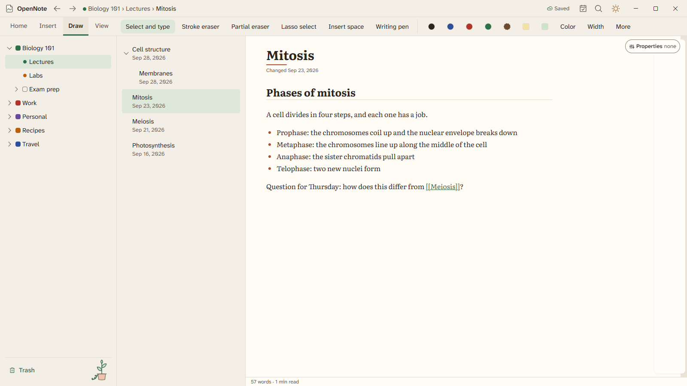

# Ink and palm rejection

Draw with a pen or a finger on any page. Open the Draw tab to pick a tool, a color, and a width.

## Pens and erasers

The Draw tab has pens, a highlighter, two erasers, the lasso, and shapes. In a wide window the pen slots sit in the bar. In a narrow one they sit under More.

- The stroke eraser removes a whole stroke. The partial eraser cuts a stroke where you rub.
- Turn the pen over to use its eraser end.
- The lasso selects strokes. Drag them to move them. Ctrl+Z and Ctrl+Y undo and redo.
- Filters let the eraser or lasso touch only highlighter, or only ink.

## Palm rejection

Rest your hand on the screen and write. While a pen is near the screen, a touch never draws. A palm does not scroll or select either.

OpenNote judges each touch from its size, how fast it grows, where on the hand it is, and how it moves. Touch ink is kept so OpenNote can take it back if the touch turns out to be a palm.

Open Settings, then Pen and touch, to change this.

| Setting                 | Choices                                                                |
| ----------------------- | ---------------------------------------------------------------------- |
| Writing hand            | Detect, Right hand, or Left hand                                       |
| Draw with a finger      | Until a pen is used, Always, or Never                                  |
| Pen buttons             | What the side button and the eraser end do, set for each pen           |
| Pressure and steady pen | A pressure curve from light to firm, and smoothing for a steadier line |

## Shapes and gestures

- Draw a rough shape and hold the pen still. It snaps to a clean circle, rectangle, triangle, star, or arrow. Keep holding to resize it before you lift.
- Scribble over words to erase them. Circle something, then tap, to select it.
- Double tap with two fingers to undo. Double tap with three to redo.
- Draw a grid and it becomes a table.

## Helpers

Press Ctrl+K and choose one of these by name.

| Name                                | What it does                                                    |
| ----------------------------------- | --------------------------------------------------------------- |
| Insert space                        | Drag down to push everything below further down.                |
| Zoom writing box                    | Write large in a box. It lands small on the line.               |
| Replay ink                          | Plays your strokes back, and plays a recording along with them. |
| Ruler, Protractor, and Snap to grid | Help you draw neat diagrams.                                    |

### Snap to paper lines

On lined, grid, or dot paper, lines, arrows, and shapes snap to the paper's own lines as you draw them. On grid paper a corner near a crossing lands on it, and on dot paper it lands on a dot. On lined paper a shape snaps to the rules and to the margin line (turn it on with Margin line in View, Background), and a line drawn close to level and near a rule lies on it. A point snaps only when it is near a line, within about a third of the spacing, so a line drawn in the page's header or midway between two rules stays where you drew it. Rectangles and ellipses keep their sizes in whole squares. Moving or resizing a shape by its handles snaps too, and the arrow keys move a selected shape one square at a time. A small ring shows where a point snapped.

- Hold Alt while you draw or drag to place a shape freely, just that once.
- Turn it off with Snap to paper lines in the Draw tab, or under More when the window is too narrow to show it. The setting is remembered. On plain paper the same switch is Snap to grid, with its own grid size.
- Handwriting and other freehand ink never snap.

## Handwriting to text

Lasso your writing and choose Convert to text. The Writing pen converts as you write. Both use on-device intelligence, which you turn on in Settings. See [on-device intelligence](on-device-intelligence.md).

Ink and palm rejection are built. They have been checked by automated tests only, and the real-pen test in [palm-rejection.md](../testing/palm-rejection.md) is waiting for a person with a pen.
