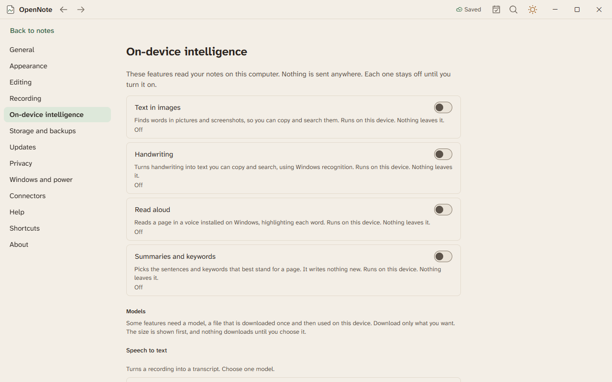
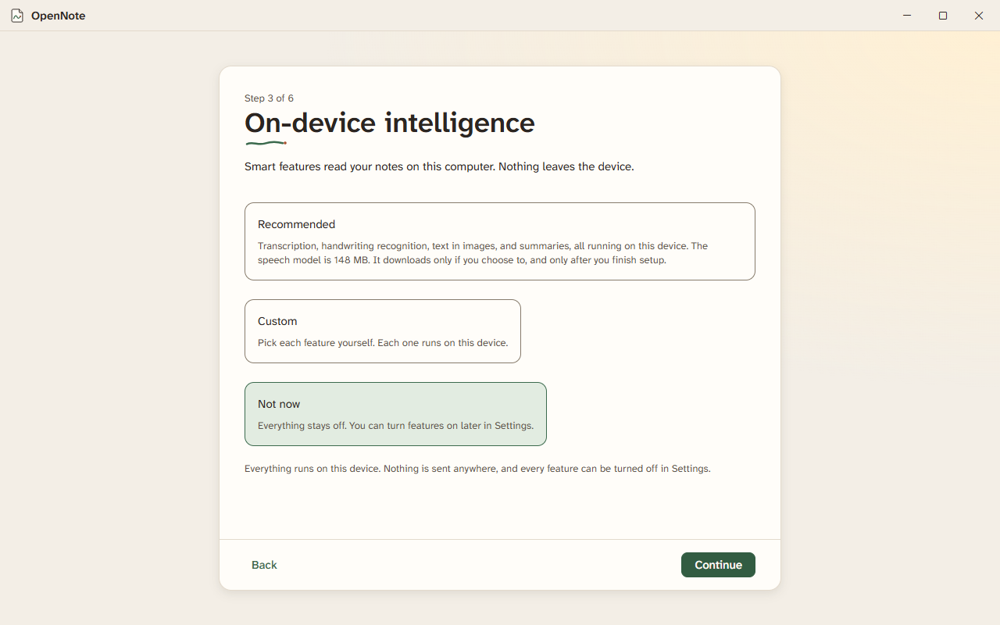

# On-device intelligence

Some features read pictures, hear speech, or write for you. In OpenNote they run on your computer. Each one is off until you turn it on.

## Turn features on

First-time setup has a step for this, and Not now is a fine answer.

Later, open Settings, then On-device intelligence. Each feature shows what it does. A feature that needs a model asks before it downloads one, and tells you its size.

## What you can do

| Feature | How to use it |
|---|---|
| Text in pictures | Right-click a picture and choose Copy text from image. Turn on Search text in pictures to find the words with search. |
| Read aloud | Select text, press Ctrl+K, and choose Read aloud. |
| Summaries | Ask for a summary of a page. |
| Handwriting to text | Lasso your writing and choose Convert to text. Tidy handwriting straightens it and evens the spacing. |
| Search by meaning | Search finds pages by what they mean. A Related pages list shows pages like this one. |
| Ask your notes | Press Ctrl+K and choose Ask. The answer lists the pages it used. |
| Writing tools | Select text, then proofread, rewrite, shorten, make a list, or tidy it. |
| Transcription | Download a speech model, then choose Make a transcript on a recording. See [recording](recording.md). |
| Custom vocabulary | Add names and course terms for each notebook. |

Work that runs in the background shows in an activity panel. You can stop it there.

## What to know

- Nothing leaves your computer.
- Windows language packs and voices must be installed for text recognition and read aloud.
- Turning a feature off stops its work at once.

## Not built yet

Dictation, live captions, telling speakers apart, turning handwritten math into an equation, and translating on your device are not built. See the [feature list](../FEATURES.md).

On-device intelligence is built. Agents checked it with tests and by opening its settings. Nobody has tried it by hand.
