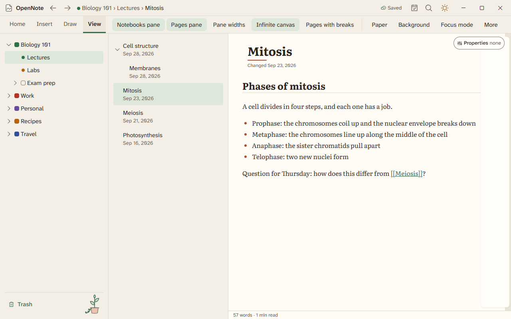
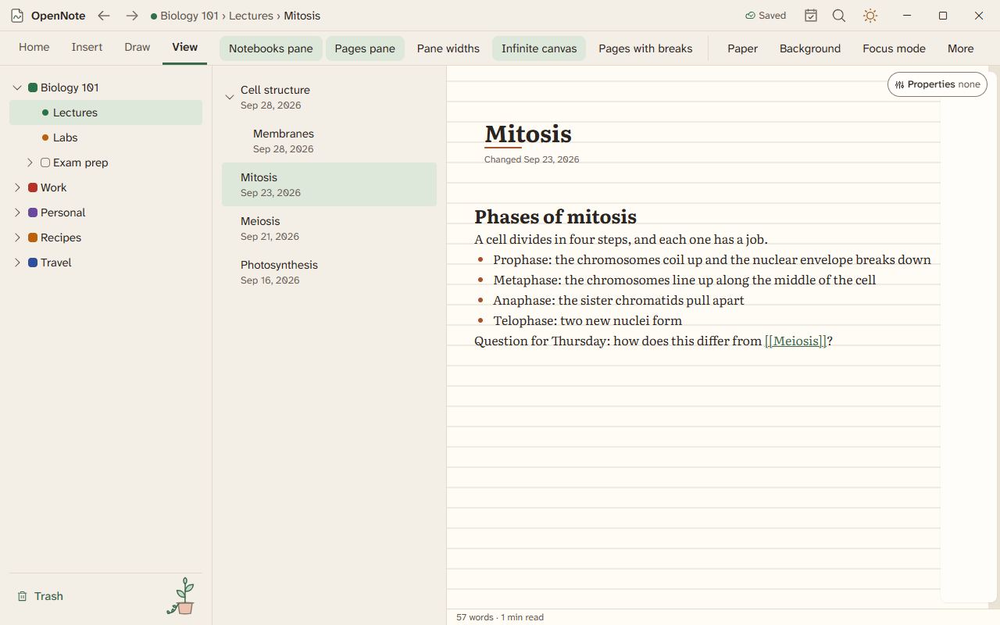

# Paper and page views

Choose how a page looks and how it prints. Everything here is in the View tab.

## Page views

| View | What it is |
|---|---|
| Flow | A document that grows downward. |
| Paginated | Sheets with page breaks, in Letter or A4. A strip of sheets at the side lets you jump. |
| Canvas | An infinite page where text boxes and ink sit anywhere. |

Open View, then Page view, to switch. Each page remembers its own scroll, zoom, and view.

## Paper

Open View, then Background, and pick Lined, Grid, or Dotted. Rule spacing has presets such as narrow, college, and wide, and you can set your own.

Text rests on the rules like handwriting. The bottoms of the letters touch the rule, and descenders hang below it. Body text takes one rule per line, and headings take whole rules.

On lined, grid, and dot paper, a text box snaps to the rules when you make it, drag it, or resize it. The arrow keys nudge it one rule at a time.

## Layout presets

Presets include a lab notebook, a planner, and a storyboard. You can set a preset for one page or as the default for a notebook, and save your own layout to use again.

## Show, present, and print

- Press Ctrl+K and choose Present to show pages as slides. Arrow keys move. Escape ends.
- The gallery shows every page of a section as a card.
- Reading aids include line focus, colors, syllable marks, and the immersive reader.
- Press Ctrl+P to print. The preview shows what prints, with page breaks.
- Export a page as PDF from its Export menu. The PDF keeps the text selectable and adds bookmarks from your headings.
- Lasso an area to export it as PDF, PNG, SVG, or Word, or copy it as an image.

Page views and paper are built. Print and PDF on lined paper have been checked by tests and by reading the code, and nobody has printed one yet.
