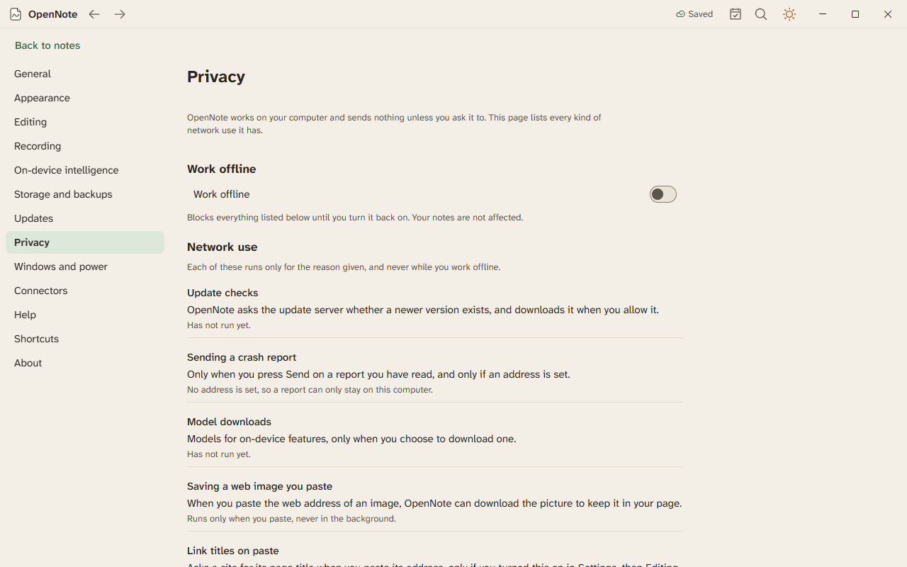

# Privacy and Work offline

OpenNote works on your computer and sends nothing unless you ask it to. Settings has a Privacy page that lists every kind of network use.

## Work offline

Open Settings, then Privacy, and turn on Work offline. OpenNote then makes no network requests. Update checks and web images pause. Your notes are not affected.

While you work offline, a chip says Working offline. Choose Go online on it to turn the switch off. Connecting an account is refused while you are offline.

## What uses the network

The Privacy page lists each use, why it runs, and when it last ran.

| Use | When |
|---|---|
| Update checks | OpenNote asks whether a newer version exists. |
| Sending a crash report | Only when you press Send on a report you have read. |
| Saving a web image | Only when you paste the address of an image. |
| Link titles on paste | Off by default. It asks the linked site for a title. |
| Signing in to an account | Only when you connect one in Settings, then Connectors. |

## Crash reports

Crash reports are off until you turn them on. The first time OpenNote starts, it asks. A report holds where in the program the crash happened. It never holds your notes. Choose Show an example to see one before you decide.

## Help when something goes wrong

- Help, then Check OpenNote, runs a self-check.
- Help, then Send feedback, builds a file with the log and the self-check. Note titles are removed. You choose whether to send it.
- After two crashes in a row, OpenNote offers a safe start.
- Account tokens are removed from the log and the feedback file.

Privacy settings are built. Agents opened them once, and nobody has tried them by hand. The [HARDENING guide](../HARDENING.md) explains how they work.
