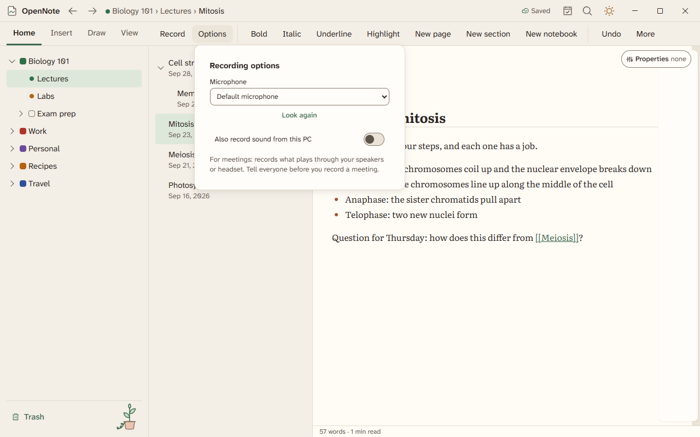

# Recording

Record a lecture or a meeting while you type or write. Your notes are stamped with the time, so you can tap one later and hear that moment.

## Start and stop

1. Choose Record, or press Ctrl+K and choose Start recording. Allow the microphone if Windows asks.
2. Open Options to pick a microphone. Turn on Also record sound from this PC to capture the other people in a meeting.
3. Type or write your notes. Add a flag to mark a moment you want to find again.
4. Pause, resume, or stop. A recording block appears on the page.

OpenNote reminds you to tell everyone before you record a meeting. If the app stops while it records, it offers to recover the recording the next time you start.

## Play it back

Tap a stamped word or stroke and the recording plays from that moment. You can change the speed and skip back or forward.

## Tidy a recording

| To do this | Do this |
|---|---|
| Cut dead air at the start or end | Choose Trim. |
| Split a recording in two | Choose Split in the More menu. |
| Remove a part you marked off the record | Remove it. The audio, the transcript, and the search index all lose it. |
| Make a quiet voice clearer | Turn on Voice enhancement. |
| Share the audio | Export the recording as an audio file. |
| Free up disk space | Open the recording storage list. Compress a recording, or remove its audio and keep the transcript. |

Settings has a Recording section for the defaults.

## Transcripts and recaps

A transcript block lists each line with its time, and a click jumps to that moment. You can rename a speaker once, and every line updates. You can turn lines into notes, pull out action items and chapters, and copy a meeting recap.

In beta 4 OpenNote cannot turn speech into text by itself yet. The transcript block, speakers, and recaps are built, and the speech engine is not. See [on-device intelligence](on-device-intelligence.md).

Recording is built. Agents started a recording once and it worked. Nobody has tried the rest by hand.
