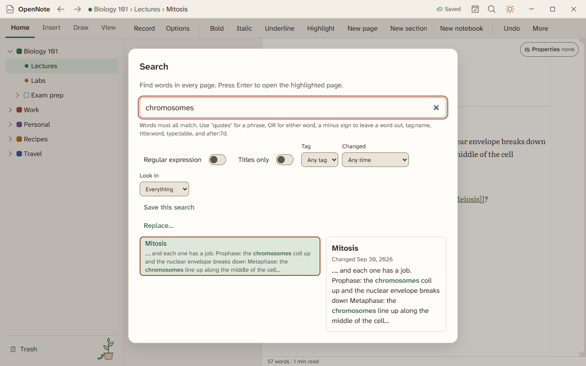
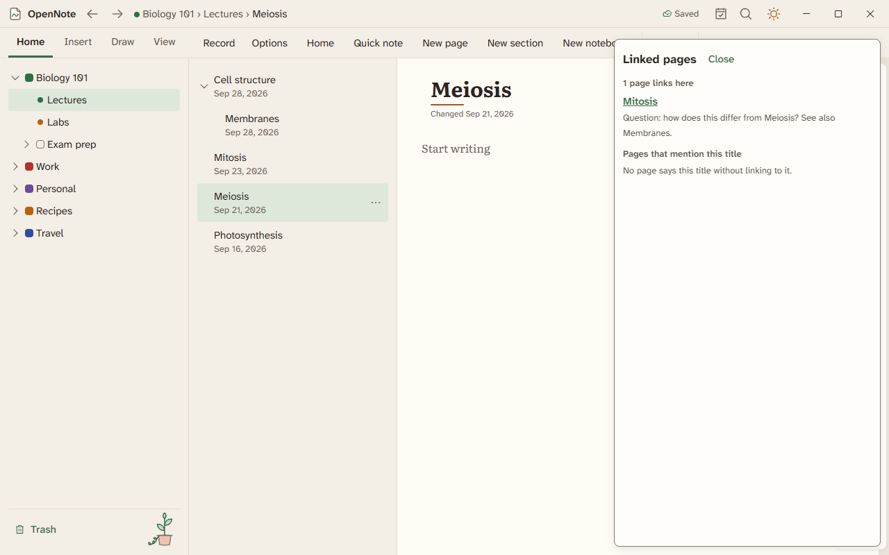

# Search and links

Find any word you wrote, and connect pages to each other.

## Search

Press Ctrl+Shift+F to open the search panel. A word you typed a minute ago is found. Add `in:` to limit a search to one notebook.

Text inside pictures is searchable too, after you turn on Search text in pictures. See [on-device intelligence](on-device-intelligence.md).

Press Ctrl+O to jump to a page by name. Press Ctrl+K to search pages and commands together.

## Link pages

- Type `[[` and pick a page to link to it.
- Right-click a paragraph and choose Copy link to link to that paragraph.
- Links that start with `opennote://` open a page from another app.
- Links keep working when you rename or move a page.

Open a page and look at its linked pages pane to see every page that links to it.

## Tags and properties

Type `#todo` and the tag is listed in the Tags pane and found by search. Tag a single line to see just those lines together. Pages can also carry properties, and a collection shows the pages that match.

## Daily notes and the map

- Press Ctrl+K and choose Daily note to open today's page.
- The calendar lists your daily notes.
- The graph view and Connections list show how pages link.
- The canvas of cards lays pages out as cards you can arrange.

## Replace everywhere

Press Ctrl+K and choose Replace in all notebooks. You see a preview before anything changes.

Search and links are built and have been checked by automated tests only.

## Pin sections and color pages

Right-click a section and choose Pin section to keep it at the top of its notebook. Right-click a page and choose Color to mark it with a colored dot. Both stay with the notebook.

A link or a search result that points inside a folded heading or list item opens the fold first, so you land on the words and not on a closed section.
