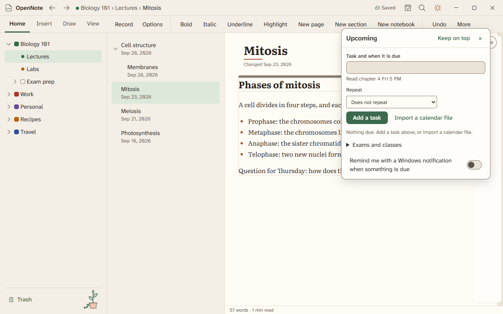
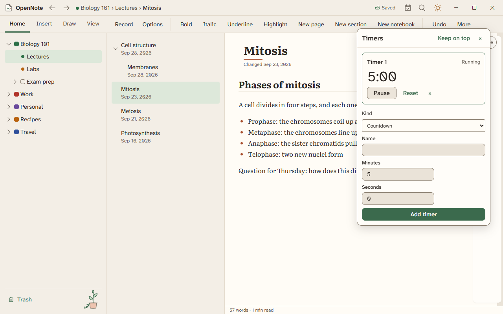

# Study tools

Make flashcards from your notes, plan what is due, and keep small tools one click away.

## Flashcards

Open Insert, then Flashcards. A page can hold several decks.

- Card types are question and answer, fill in the blank, multiple choice, and image occlusion, which hides part of a diagram.
- Type `Q :: A` on a line to make a card in place. Type `{{blank}}` in a sentence for a fill-in-the-blank card.
- Review cards in the review screen. A schedule shows which cards are due.
- Set an exam date for a deck and the schedule works back from it.
- Import and export Anki decks (`.apkg`) and CSV files.

Study tape covers part of a page. Press it to show what is under it.

## Upcoming

The Upcoming window lists exams, classes, and tasks.

- Import a calendar (`.ics`) file to fill in your classes.
- Put a due date on a checkbox, and repeat it if you need to.
- Set a reminder and Windows shows a notification.

## Small tools

Press Ctrl+K and choose one by name. Each opens in its own window.

| Tool | What it does |
|---|---|
| Timers | Countdowns that keep running while you write. |
| Calculator | Works out sums and unit conversions, and keeps a history. |
| Unit converter | Converts length, mass, time, temperature, area, volume, speed, pressure, energy, power, angle, and data size. |
| Reference tables | Looks up common tables. |
| Exam countdown | Counts the days to each exam. |
| Citations | Keeps a list of sources from BibTeX, RIS, and Zotero, and inserts citations. |

## Not built yet

Making cards from a page, a section, or a transcript is not built. Neither is a dictionary and thesaurus tool.

Study tools are built. Agents opened the tool windows once. Nobody has tried the rest by hand.
