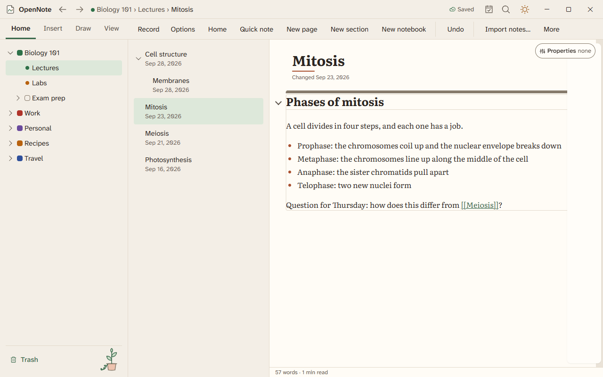

# Typed notes

A page holds text boxes, headings, lists, checklists, quotes, code, callouts, tables, and pictures. This page covers the everyday keys and menus.

## Add things to a page

| To do this | Do this |
|---|---|
| Insert a table, code block, callout, divider, or date | Type `/` on an empty line to open the slash menu. The Insert tab has the same items. |
| Make a heading | Press Ctrl+Alt+1, Ctrl+Alt+2, or Ctrl+Alt+3. |
| Make text bold | Press Ctrl+B. |
| Link to another page | Type `[[` and pick a page. |
| Show another page inside this one | Type `.

## Checklists

Press Ctrl+Enter to check or uncheck an item. Finished items move down, and the list shows a count. Choose Check all to finish a whole list.

## Find, count, and navigate

| To do this | Do this |
|---|---|
| Find on the page | Press Ctrl+F. |
| Replace on the page | Press Ctrl+H. |
| See the word count and reading time | Press Ctrl+K and choose Word count. |
| Jump between headings | Press Ctrl+K and choose Contents. Select a heading to go to it. |
| Stop accidental edits and ink | Press Ctrl+K and choose Lock page. Choose it again to turn the lock off. |
| Make the caret easier to see | The caret follows the Windows text cursor settings: its thickness, its blinking, and the indicator color. Turn on Settings, Accessibility, Text cursor in Windows, or choose a width in OpenNote's settings. |

## Templates, series, and the source

- Start a page from a template when you make it.
- Choose Next in series to make the next numbered page, such as the next lecture.
- Press Ctrl+K and choose Markdown source to edit the page as Markdown. The page updates as you type.
- Select blocks and choose Extract to new page to move them out. Select two pages and choose Merge to join them.

## Pictures and files

- Right-click a picture and choose Alt text to get a first draft you can edit.
- Choose Wrap on a picture to set text around it on a document page.
- Choose Size and position on a picture to type its size and how much to crop from each side. Reset crop puts the whole picture back.
- Drop a file, a PDF, or a link on the page to attach it. A Word file you edit and save comes back into the page.
- A PDF or Office attachment shows its first page on the card. To keep a file outside the note, right-click the attachment and choose Save a copy of the attachment. The note keeps its own copy.

## Spelling and reading aloud

A misspelled word is marked. Right-click it for fixes. Select text, press Ctrl+K, and choose Read aloud to hear it in a Windows voice. Nothing is sent anywhere.

Typed notes are built and, in beta 4, not yet tried by hand. The [feature list](../FEATURES.md) says where each one stands.
